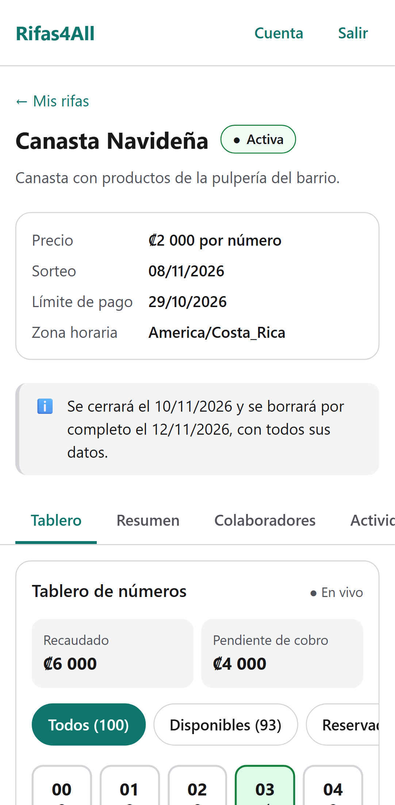
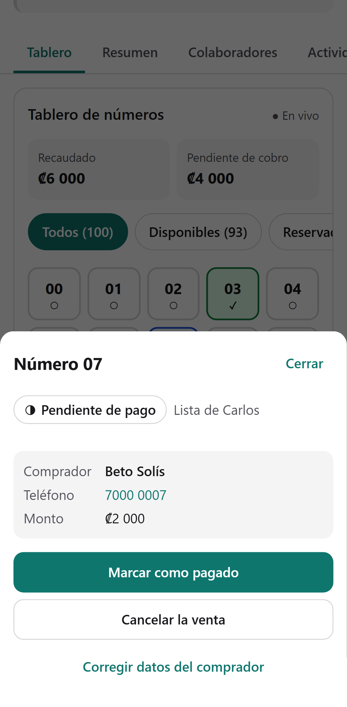
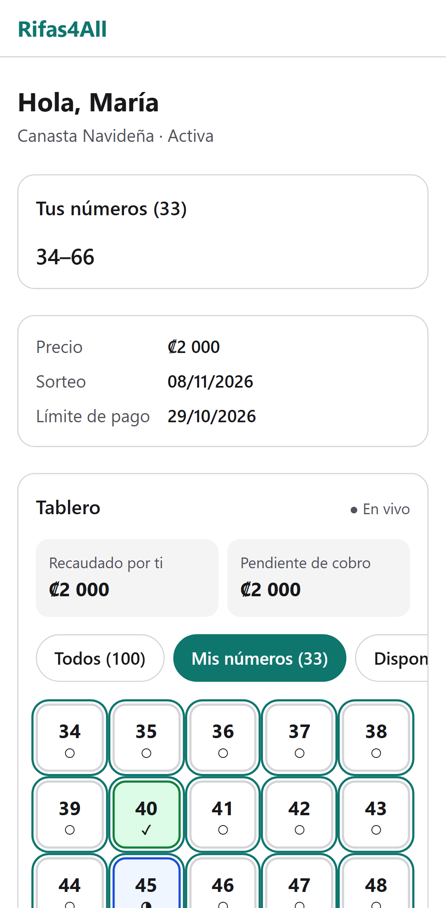
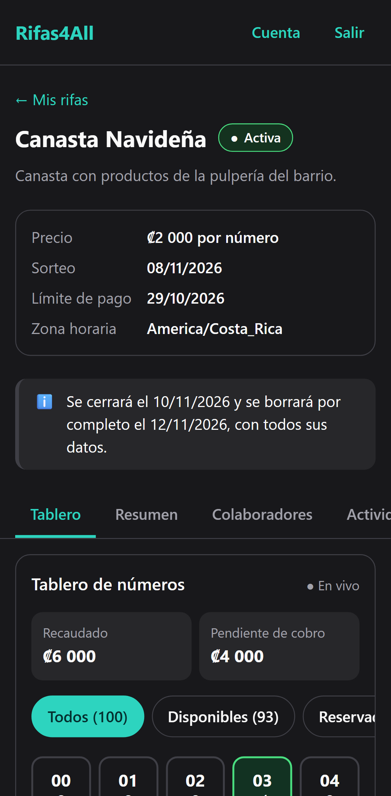
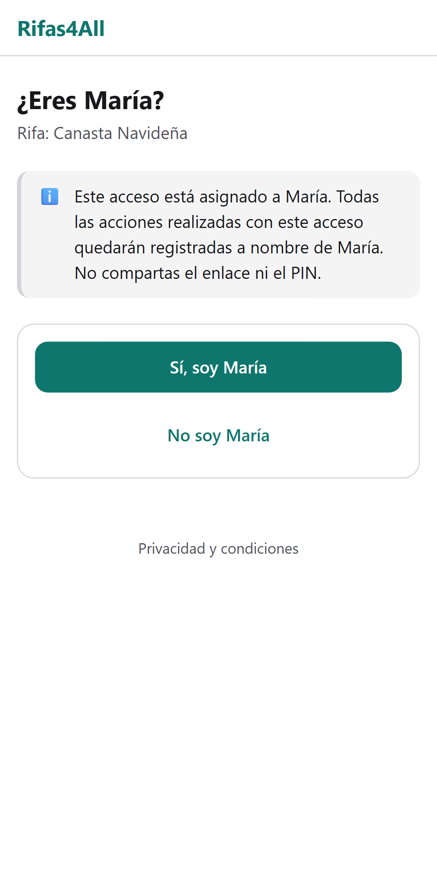
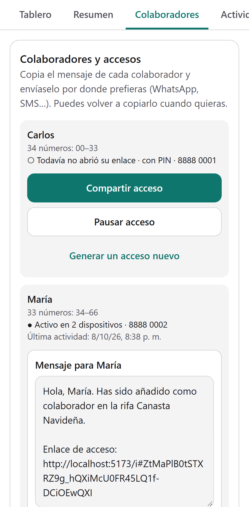
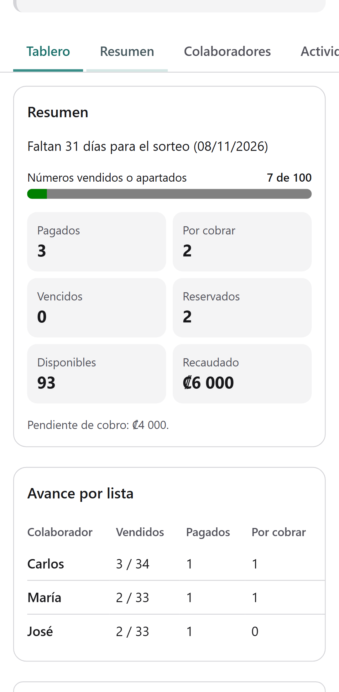
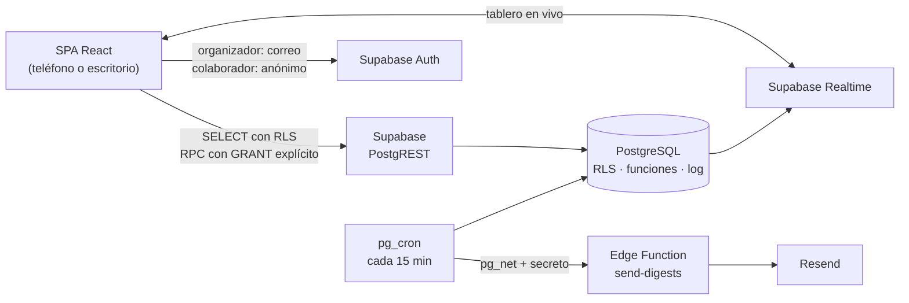

# Rifas4All

[](https://github.com/JuanC67811/rifas4all/actions/workflows/ci.yml)

Aplicación web gratuita y mobile-first para administrar **rifas pequeñas de 100 números** (familiares, escolares, de barrio) entre una persona organizadora y hasta 12 colaboradores que **no necesitan registrarse**.

| Tablero en vivo                                                                                 | Registrar un comprador                                                                               | Lista del colaborador                                                                 | Modo oscuro                                                    |
| ----------------------------------------------------------------------------------------------- | ---------------------------------------------------------------------------------------------------- | ------------------------------------------------------------------------------------- | -------------------------------------------------------------- |
|  |  |  |  |

| Activación del colaborador                                                                  | Compartir el acceso                                                           | Resumen y avance por lista                                                                    |
| ------------------------------------------------------------------------------------------- | ----------------------------------------------------------------------------- | --------------------------------------------------------------------------------------------- |
|  |  |  |

## Cómo funciona

1. La organizadora crea una cuenta y una rifa (00–99).
2. Agrega de 1 a 12 colaboradores; la app reparte los 100 números de forma equitativa, en orden o al azar.
3. Copia el mensaje de cada colaborador (enlace personal + PIN opcional) y lo envía por donde quiera.
4. Cada colaborador abre su enlace, confirma "Sí, soy Carlos" y gestiona **solo sus números**: compradores, reservas y pagos.
5. Todos ven el tablero **en tiempo real**, sin ver los compradores de los demás.
6. Cada acción queda en un registro que no se puede modificar, y la organizadora recibe un **resumen diario**.
7. La rifa se cierra sola 2 días después del sorteo y se borra por completo 4 días después.

## Tecnologías

React 19 · TypeScript estricto · Vite · Tailwind CSS 4 · TanStack Query · React Router · Zod · Supabase (PostgreSQL, Auth, Realtime, Row Level Security, Edge Functions, pg_cron) · Vitest · Testing Library · pgTAP · Playwright · axe-core · GitHub Actions

## Cifras del proyecto

|                                             |                                                                                                                                           |
| ------------------------------------------- | ----------------------------------------------------------------------------------------------------------------------------------------- |
| Pruebas de base de datos (pgTAP)            | **239**: estructura, privilegios, RLS con 8 perfiles, funciones de negocio y tareas programadas                                           |
| Pruebas unitarias y de componentes (Vitest) | **125**                                                                                                                                   |
| Pruebas end-to-end (Playwright)             | **28** en móvil y escritorio, con dos navegadores a la vez para el tiempo real, más auditorías WCAG 2.1 AA con axe en tema claro y oscuro |
| Decisiones de arquitectura documentadas     | [5 ADR](docs/adr/)                                                                                                                        |
| CI                                          | Lint, formato, tipos, tests, build, `supabase db lint`, pgTAP y e2e con Supabase completo en cada push                                    |

## Principios de diseño

- **La base de datos es la que protege.** Los permisos se aplican con Row Level Security y funciones SQL, no ocultando botones. Nada es accesible desde la API sin un permiso explícito ([ADR 0002](docs/adr/0002-permisos-denegados-por-defecto.md)).
- **Privacidad entre colaboradores.** El estado público de cada número y los datos del comprador viven en tablas separadas: RLS filtra filas, no columnas.
- **Integridad ante concurrencia.** Un número nunca tiene dos ventas activas, aunque se pulse dos veces o se edite desde dos teléfonos a la vez.
- **Sin sobreingeniería.** Cada dependencia y cada abstracción está justificada en el [diseño técnico](docs/rifas4all-diseno-tecnico.md) o en un ADR.

## Arquitectura



### La base de datos

| Regla                                               | Cómo se garantiza                                                                                                                                        |
| --------------------------------------------------- | -------------------------------------------------------------------------------------------------------------------------------------------------------- |
| Un número nunca tiene dos ventas activas            | Índice único parcial `sales (raffle_id, number) WHERE status <> 'cancelled'`                                                                             |
| Un colaborador solo vende sus números               | Clave foránea compuesta `(raffle_id, number, collaborator_id)`                                                                                           |
| El estado público del número coincide con su venta  | Se deriva por trigger desde `sales`                                                                                                                      |
| Máximo 12 colaboradores y 5 rifas por cuenta        | `CHECK` + `UNIQUE`; trigger con bloqueo de fila                                                                                                          |
| El log no se modifica ni guarda datos del comprador | Trigger contra `UPDATE`/`TRUNCATE` + `CHECK` sobre `details`                                                                                             |
| Nadie escribe directamente en las tablas            | Toda escritura es una función SQL que valida actor, estado y versión en una transacción ([ADR 0003](docs/adr/0003-escrituras-mediante-funciones-sql.md)) |

**Quién lee qué (RLS):** la organizadora ve todo lo de sus rifas; un colaborador ve el tablero completo, pero solo los compradores y la actividad de su lista; un acceso pausado o revocado deja de ver todo en la siguiente petición. Las políticas se prueban con 8 perfiles, incluido un usuario anónimo que intenta hacerse pasar por organizador. Se comprobó también que, si se abre a propósito una política, las pruebas fallan.

**Concurrencia:** cada acción envía la versión del número que la persona estaba viendo y un `request_id`. Un doble toque devuelve el estado actual sin repetir nada. Si otra persona cambió el número, la versión obsoleta recibe `R4A_CONFLICT`. Se verificó con dos sesiones de PostgreSQL vendiendo el mismo número a la vez.

**Tareas programadas (pg_cron, idempotentes):** vencimiento de pagos, cierre a los 2 días del sorteo, borrado total a los 4, cola del resumen diario y limpieza de usuarios anónimos.

### Acceso de colaboradores sin cuenta

El token viaja en el **fragmento** de la URL (`/i#token`), que nunca llega al servidor, y se borra de la barra de direcciones al abrir el enlace. Al confirmar "Sí, soy Carlos" (+PIN), el navegador recibe una sesión anónima de Supabase ligada a Carlos. Cinco PIN incorrectos bloquean el acceso 15 minutos, y hay un máximo de 2 dispositivos por colaborador. La organizadora puede pausar un acceso o generar uno nuevo sin tocar ventas ([ADR 0004](docs/adr/0004-acceso-de-colaboradores-sin-cuenta.md)).

### Resumen diario

Un correo por organizador a medianoche (su zona horaria), calculado desde el log en texto plano: movimientos del día anterior y cobros por vencer. La Edge Function reserva lotes con `SKIP LOCKED`, usa claves de idempotencia y reintenta con espera creciente. Mientras no haya dominio de correo, el mismo texto se lee en la app ([ADR 0005](docs/adr/0005-resumen-diario-por-correo.md)).

### Frontend

| Carpeta         | Qué contiene                                                                                                                                                                           |
| --------------- | -------------------------------------------------------------------------------------------------------------------------------------------------------------------------------------- |
| `src/domain/`   | Reglas en TypeScript puro, sin React ni Supabase: dinero en unidades menores, fechas por zona horaria, máquina de estados (espejo de la base de datos), teléfonos E.164, recordatorios |
| `src/lib/`      | Cliente de Supabase, traducción centralizada de errores (`R4A_CONFLICT` → mensaje en español), caché                                                                                   |
| `src/features/` | Una carpeta por funcionalidad (`auth`, `raffles`, `collaborators`, `collaborator`, `board`, `dashboard`, `activity`, `account`) con datos, hooks y pantallas                           |
| `src/ui/`       | Componentes accesibles: botones de 48 px, campos con error enlazado, `<dialog>` nativo, pestañas WAI-ARIA                                                                              |

**Accesibilidad:**

- etiquetas visibles en todos los campos;
- foco en el primer error al enviar un formulario;
- estados con icono y texto, nunca solo color;
- pestañas que se recorren con las flechas del teclado;
- enlace "Saltar al contenido";
- auditoría axe automática en la CI.

**Rendimiento:** las pantallas se cargan bajo demanda (JavaScript inicial ≈155 KB comprimido).

**Seguridad en el navegador:** CSP estricta, sin iframes y sin referrer ([`public/_headers`](public/_headers)).

## Ejecutar en local

Requisitos: Node.js 24 y Docker Desktop (en Windows, con WSL 2).

```bash
git clone https://github.com/JuanC67811/rifas4all.git
cd rifas4all
npm install
npm run db:start
cp .env.example .env.local
npm run dev
```

`npm run db:start` muestra la clave publicable local; cópiala en `.env.local`. La base local trae una cuenta de demostración (`demo@rifas4all.local` / `rifas4all-demo`) con una rifa activa y otra en borrador. Esos datos solo existen en tu equipo.

| Comando                     | Qué hace                                                                          |
| --------------------------- | --------------------------------------------------------------------------------- |
| `npm run dev`               | Servidor de desarrollo en http://localhost:5173                                   |
| `npm run check`             | Lint + formato + tipos + pruebas unitarias                                        |
| `npm run test:e2e`          | Pruebas end-to-end y de accesibilidad (requiere Supabase local)                   |
| `npm run db:test`           | Pruebas de la base de datos con pgTAP                                             |
| `npm run db:reset`          | Recrea la base local con migraciones y datos de ejemplo (borra los datos locales) |
| `npm run db:types`          | Regenera los tipos de TypeScript desde la base de datos                           |
| `npm run build` / `preview` | Compila y sirve el build con la misma CSP que producción                          |
| `npm run screenshots`       | Regenera las capturas de este README                                              |

## Documentación

| Documento                                                                     | Contenido                                                                    |
| ----------------------------------------------------------------------------- | ---------------------------------------------------------------------------- |
| [Diseño técnico](docs/rifas4all-diseno-tecnico.md)                            | Alcance, permisos, flujos, máquinas de estado, modelo de datos, RLS, riesgos |
| [Revisión crítica del primer diseño](docs/rifas4all-revision-critica-v0.1.md) | Vulnerabilidades encontradas en la v0.1 y cómo se corrigieron                |
| [Decisiones de arquitectura](docs/adr/)                                       | Una decisión por archivo, con alternativas y consecuencias                   |
| [Despliegue](docs/despliegue.md)                                              | Supabase, hosting, correo y verificación después de publicar                 |

## Estado

Las 8 fases del plan están completas: el MVP está implementado y probado. Falta la **publicación**, que requiere crear las cuentas de Supabase, el hosting y, para el correo, un dominio propio. Los pasos están en [docs/despliegue.md](docs/despliegue.md).

## Limitaciones conocidas

- La app identifica **accesos**, no personas: si un colaborador comparte su enlace y su PIN, las acciones se registran a su nombre. Se advierte al activar el acceso.
- No procesa pagos ni realiza el sorteo: solo coordina la venta y el cobro.
- 4 días después del sorteo la rifa se borra por completo, incluidos los pagos pendientes. Es deliberado por privacidad, y la app lo avisa con anticipación.

## Autor

**Juan Carlos Martínez** · [GitHub](https://github.com/JuanC67811)
