# Rifas4All — Documento de diseño técnico (v0.1)

> Estado: **borrador para aprobación**. No contiene código.
> Fecha: 2026-10-08.
> Convención: **[OBL]** requisito obligatorio · **[REC]** recomendación · **[FUT]** idea futura (fuera del MVP) · **[SUP]** suposición adoptada (revisable).

---

## Parte A — Antes de diseñar

### A.1 Mi interpretación de Rifas4All

Rifas4All es una herramienta de **coordinación** (no de pagos ni de sorteo) para rifas pequeñas de 100 números. El problema real que resuelve es el caos de "¿quién vendió el 27?, ¿ya pagó?" en un grupo de WhatsApp. Hay una sola persona responsable (el creador, con cuenta) y hasta 12 ayudantes (colaboradores, sin cuenta) que reciben un enlace personal. Cada uno gestiona solo sus números; todos ven el tablero general sin datos privados; el creador lo ve todo y recibe correos. Todo queda en una bitácora inmutable.

Las tres propiedades que definen la calidad del producto son:

1. **Fricción mínima** para el colaborador (abrir enlace → "Sí, soy Carlos" → listo).
2. **Integridad**: un número nunca tiene dos compradores activos, ningún colaborador toca lo ajeno, y eso lo garantiza la base de datos, no React.
3. **Privacidad entre colaboradores**: nombres y teléfonos de compradores solo los ven el creador y el colaborador dueño del número.

### A.2 Decisiones ya confirmadas por ti

| Tema | Decisión |
|---|---|
| Stack | React + TypeScript + Vite + Tailwind; Supabase (Postgres, Auth, Realtime, RLS, Edge Functions) |
| Cuentas | Solo el creador se registra (correo). Colaboradores sin cuenta. |
| Colaboradores | 1–12 por rifa, nombre obligatorio, teléfono opcional, PIN opcional de 4 dígitos |
| Números | Exactamente 100 (00–99), siempre con dos dígitos |
| Distribución | Solo automática: en orden o aleatoria; equitativa (diferencia ≤ 1); sin reasignación manual |
| WhatsApp | Solo enlaces `wa.me` / mensajes preparados que la persona envía manualmente |
| Correo | Solo al creador; desacoplado de la transacción de venta |
| Recordatorio | 3 días antes de la fecha límite de pago; correo + alerta en panel + mensaje WhatsApp preparado |
| Log | Obligatorio, append-only, sin secretos |
| Exclusiones | Lista de la sección 23 de tu enunciado (archivos, pagos, SMS, app nativa, etc.) |

### A.3 Contradicciones y vacíos detectados (y cómo los resuelvo)

| # | Tensión | Resolución propuesta |
|---|---|---|
| C1 | "El creador no puede consultar el PIN" **vs.** "compartir el PIN por WhatsApp". | El PIN se **muestra una sola vez** (al generarlo o restablecerlo), en la misma pantalla del botón "Compartir". Después solo existe su hash. Si se pierde → restablecer. |
| C2 | "No exponer el PIN en URLs" **vs.** compartir con `wa.me/?text=…PIN…` (el texto viaja en la query string de una URL de WhatsApp y queda en el historial del navegador). | Canal principal: **Web Share API** (`navigator.share`), que no usa URL. Alternativa: "Copiar mensaje". `wa.me` con el PIN solo como último recurso y con aviso; **[REC]** ofrecer enviar el enlace y el PIN en dos mensajes separados. |
| C3 | "Cancelado" como estado del número **vs.** número que vuelve a estar disponible. | **Cancelado es un estado de la *venta*, no del número.** El número vuelve a `disponible`; la venta cancelada queda como registro histórico (ver §21). |
| C4 | Fecha límite de pago **a nivel de rifa** (configuración obligatoria) **y** a nivel de comprador. | La rifa define la fecha por defecto; cada venta puede tener una **fecha propia opcional** (solo el creador la cambia). Fecha efectiva = `coalesce(fecha_venta, fecha_rifa)`. Si el creador mueve la fecha de la rifa, todas las ventas sin fecha propia se mueven solas. |
| C5 | "Reservado" y "Pendiente de pago" exigen los mismos datos; su diferencia no está definida. | **[SUP]** *Reservado* = "apártamelo", sin compromiso de pago; no genera deuda, ni recordatorio, ni vencimiento (solo alerta visual si lleva >3 días). *Pendiente* = compra acordada, cuenta como deuda, tiene fecha límite, recordatorio y puede vencer. (Pregunta P1.) |
| C6 | "Log permanente" **vs.** eliminación/anonimización de datos personales. | El log **nunca guarda datos del comprador**: guarda referencias (`sale_id`) y cambios de estado. La anonimización de una venta no rompe el log. "Permanente" = inmutable desde la aplicación durante la vida de la cuenta; si el creador borra su cuenta, se borra todo (derecho de supresión). |
| C7 | Correo de venta con nombre y teléfono del comprador **vs.** minimización. | Se incluye por defecto (es tu requisito), pero con opción "ocultar teléfono en correos". El correo nunca lleva enlaces de acceso, tokens ni PIN. |
| C8 | "Colaborador ve compradores *registrados por él*". ¿Y si el creador registra una venta en un número de Carlos? | La propiedad se define por **la lista** (el número pertenece a Carlos), no por quién lo registró. Carlos ve todas las ventas de sus números. |
| C9 | "Colaborador bloqueado mientras tiene la app abierta" + "tiempo real". | El bloqueo es inmediato en la base de datos (RLS deja de devolver datos y las funciones rechazan). La UI se entera en la siguiente petición o al reconectar; no se puede garantizar notificación instantánea a un cliente que ya no tiene permiso de leer. Es correcto y seguro. |
| C10 | "El enlace deja de mostrarse en la URL" — un token de un solo uso choca con navegadores internos de WhatsApp y con Safari, que puede borrar el almacenamiento tras 7 días sin uso. | El token es **reutilizable hasta que el creador lo rota**, pero cada uso exige confirmar identidad (y PIN si existe), crea una sesión de dispositivo registrada en el log y se limita a N dispositivos. Además va en el **fragmento** (`#`) de la URL, que el navegador no envía al servidor. Ver §26–27. |

### A.4 Preguntas estrictamente bloqueantes

**Ninguna bloquea la Fase 1 ni la Fase 2.** Las siguientes tienen una suposición adoptada; necesito tu confirmación antes de la fase indicada:

- **P1 (antes de Fase 2):** ¿Confirmas la semántica de C5 (Reservado sin deuda ni vencimiento; Pendiente con deuda, recordatorio y vencimiento)?
- **P2 (antes de Fase 6):** ¿Tienes o comprarás un dominio propio (~10–15 USD/año)? Todos los proveedores serios de correo exigen un dominio verificado (SPF/DKIM) para enviar a terceros. Sin dominio, los correos solo llegarán a tu propia dirección en pruebas. Tampoco el SMTP por defecto de Supabase Auth sirve en producción (ver §30).
- **P3 (antes de Fase 5):** ¿Puede un colaborador marcar sus ventas como **pagadas**? **[SUP] Sí** (tu §11 dice "actualizar el estado de sus ventas"), pero **solo el creador** puede revertir un pago o cancelar una venta ya pagada.

---

## Parte B — Diseño técnico

## 1. Resumen ejecutivo

Rifas4All es una SPA mobile-first sobre Supabase. Toda la lógica de negocio crítica (distribución, transiciones de estado, permisos, log, cola de correos) vive en **PostgreSQL**: funciones RPC transaccionales protegidas por RLS. El frontend es una capa de presentación que no puede romper invariantes aunque se manipule. Los colaboradores obtienen una identidad técnica mediante **inicio de sesión anónimo de Supabase** vinculada a su acceso tras validar enlace (+PIN). Los correos salen por un **patrón outbox** procesado por una Edge Function programada con `pg_cron`. Coste inicial: 0 USD (más el dominio).

## 2. Objetivo y público objetivo

- **Objetivo:** que una rifa de 100 números con hasta 12 vendedores se coordine sin hojas de cálculo ni mensajes perdidos, con trazabilidad completa.
- **Público:** familias, escuelas, comités comunales, grupos de amigos; usuarios de teléfono, a menudo con poca experiencia tecnológica y conexión irregular. Mercado inicial: Costa Rica (CRC, `America/Costa_Rica`), sin asumirlo en el modelo.
- **No-objetivo:** loterías, empresas, rifas masivas, cobros, sorteo automatizado.

## 3. Alcance exacto del MVP

1. Registro, inicio/cierre de sesión y recuperación de contraseña del creador (correo + contraseña).
2. CRUD de rifas del creador con ciclo de vida (borrador → activa → finalizada → archivada; cancelada).
3. 1–12 colaboradores por rifa (nombre, teléfono opcional).
4. Distribución automática en orden o aleatoria con vista previa y confirmación.
5. Acceso por enlace individual + PIN opcional; sesiones de dispositivo; bloqueo, rotación de enlace, restablecimiento de PIN, cierre de sesiones.
6. Tablero de 100 números con filtros, estados accesibles y panel inferior de edición.
7. Registro de compradores (nombre, teléfono; alias y nota opcionales) y máquina de estados de ventas.
8. Vencimiento automático de pagos pendientes.
9. Tiempo real del tablero y de las listas.
10. Notificaciones por correo al creador (configurables por tipo de evento) mediante outbox con reintentos.
11. Recordatorio 3 días antes (correo + alertas + mensaje WhatsApp preparado).
12. Log append-only consultable (creador: todo; colaborador: su lista).
13. Dashboard del creador y resumen del colaborador.
14. Archivado y anonimización programada de datos de compradores.
15. Pruebas (unitarias, BD/RLS, integración, E2E), CI, README y ADRs.

## 4. Funciones excluidas

Todo lo listado en tu §23 queda fuera, sin diseño. Ideas futuras **[FUT]** (solo mencionadas): rifas con N≠100 números, sorteo/ganador registrado, exportar CSV/PDF, comprobantes, notificación diaria resumida (digest) como modo alternativo, PWA offline con cola de escritura, encadenamiento hash del log, multi-idioma, panel de métricas de uso.

## 5. Actores y roles

Distinción obligatoria de identidades (tu §24):

| Nivel | Qué es | Cómo se establece | ¿Verificado? |
|---|---|---|---|
| 1. Identidad del creador | Usuario de Supabase Auth (no anónimo) con correo confirmado | Correo + contraseña | Sí (control del correo) |
| 2. Identidad técnica de sesión del colaborador | Usuario **anónimo** de Supabase Auth (uno por navegador/dispositivo) + fila en `collaborator_sessions` | Enlace válido (+PIN) | Sí, técnicamente |
| 3. Nombre atribuido | `collaborators.display_name` que escribió el creador | Lo decide el creador | No: es una etiqueta |
| 4. Persona física con el teléfono | — | — | **No se verifica nunca** |

Actores: **Creador/Administrador**, **Colaborador**, **Sistema** (jobs programados), **Visitante con enlace** (aún no activado), **Comprador** (no usa la app; solo es un dato).

## 6. Matriz de permisos

Leyenda: ✅ permitido · 🔸 solo sobre sus números / su lista · ❌ prohibido. Todo se aplica en BD.

| Acción | Creador | Colaborador | Sistema | Visitante con enlace |
|---|---|---|---|---|
| Ver nombre de la rifa y del colaborador asignado al enlace | ✅ | ✅ | — | ✅ (solo eso) |
| Ver tablero (número + estado) | ✅ | ✅ | — | ❌ |
| Ver qué colaborador tiene cada número | ✅ | ✅ si `show_collaborator_names` | — | ❌ |
| Ver comprador, alias, teléfono, nota | ✅ | 🔸 | ✅ (para correo) | ❌ |
| Reservar / vender / registrar comprador | ✅ | 🔸 | ❌ | ❌ |
| Marcar pagado | ✅ | 🔸 | ❌ | ❌ |
| Cancelar / liberar venta no pagada | ✅ | 🔸 | ❌ | ❌ |
| Revertir pago / cancelar venta pagada | ✅ (con motivo) | ❌ | ❌ | ❌ |
| Cambiar fecha límite de una venta | ✅ | ❌ | ❌ | ❌ |
| Marcar vencido | ❌ (automático) | ❌ | ✅ | ❌ |
| Editar configuración de la rifa | ✅ (según estado) | ❌ | ❌ | ❌ |
| Crear colaboradores / distribuir | ✅ (solo en borrador) | ❌ | ❌ | ❌ |
| Bloquear, rotar enlace, restablecer PIN, cerrar sesiones | ✅ | ❌ | ❌ | ❌ |
| Ver log | ✅ todo | 🔸 eventos de su lista | — | ❌ |
| Modificar/borrar log | ❌ | ❌ | ❌ | ❌ |
| Archivar / finalizar / cancelar rifa | ✅ | ❌ | ❌ | ❌ |
| Preferencias de notificación | ✅ | ❌ | — | ❌ |
| Estadísticas generales | ✅ | Solo progreso global (conteos) | — | ❌ |
| Acceder a otras rifas | Solo las suyas | Solo aquellas con sesión activa | — | ❌ |

## 7. Casos de uso

| ID | Actor | Caso de uso |
|---|---|---|
| CU-01 | Creador | Registrarse, confirmar correo, iniciar/cerrar sesión, recuperar contraseña |
| CU-02 | Creador | Crear rifa en borrador |
| CU-03 | Creador | Agregar/editar/quitar colaboradores (borrador) |
| CU-04 | Creador | Generar vista previa de distribución y confirmarla (activa la rifa) |
| CU-05 | Creador | Compartir acceso (enlace + PIN) por WhatsApp |
| CU-06 | Visitante | Activar acceso (confirmar identidad + PIN) |
| CU-07 | Colaborador | Ver tablero y filtrar |
| CU-08 | Colaborador/Creador | Reservar o vender un número |
| CU-09 | Colaborador/Creador | Confirmar pago |
| CU-10 | Colaborador/Creador | Cancelar/liberar venta |
| CU-11 | Sistema | Marcar ventas vencidas |
| CU-12 | Sistema | Generar recordatorios 3 días antes |
| CU-13 | Colaborador/Creador | Abrir WhatsApp con recordatorio preparado |
| CU-14 | Sistema | Enviar correos de la outbox |
| CU-15 | Creador | Bloquear/desbloquear, rotar enlace, restablecer PIN, cerrar sesiones |
| CU-16 | Creador | Consultar dashboard y log |
| CU-17 | Creador | Finalizar, archivar, cancelar rifa |
| CU-18 | Creador | Configurar notificaciones y plantilla de WhatsApp |
| CU-19 | Creador | Corregir cualquier venta (revertir pago, cambiar fecha, editar comprador) |
| CU-20 | Sistema | Anonimizar datos de compradores al cumplirse la retención; limpiar usuarios anónimos huérfanos |

## 8. Flujos principales (vista general)

```mermaid
flowchart LR
  A[Creador se registra] --> B[Crea rifa en borrador]
  B --> C[Agrega 1-12 colaboradores]
  C --> D[Elige método y ve vista previa]
  D -->|Confirma| E[Rifa ACTIVA + accesos generados]
  E --> F[Comparte enlaces por WhatsApp]
  F --> G[Colaborador activa acceso]
  G --> H[Ventas y pagos]
  H --> I[Correos, recordatorios, log, tiempo real]
  I --> J[Sorteo realizado: FINALIZADA]
  J --> K[ARCHIVADA]
```

## 9. Flujo del creador

1. Registro (correo + contraseña) → correo de confirmación → inicio de sesión.
2. "Nueva rifa": nombre, fecha del sorteo, precio, moneda (CRC por defecto), fecha límite de pago, zona horaria (por defecto la del navegador; CR), descripción opcional. Se guarda como **borrador** en cada paso (no se pierde información).
3. Colaboradores: lista editable de 1–12 filas (nombre obligatorio, teléfono opcional, interruptor "Proteger con PIN").
4. Método de distribución → "Ver vista previa" → resumen (cuántos números y cuáles por persona).
5. "Confirmar y activar" (diálogo de confirmación: "Después no podrás cambiar colaboradores ni distribución").
6. Pantalla "Compartir accesos": por colaborador, botón **Compartir** (Web Share) / **Copiar** / **WhatsApp**. El PIN y el enlace se ven **solo aquí y ahora**; aviso explícito.
7. Dashboard: tablero, listas, alertas, actividad, configuración, log.

## 10. Flujo del colaborador

1. Recibe mensaje por WhatsApp y toca el enlace.
2. Pantalla de activación (§11).
3. Entra a "Mi lista": resumen arriba (vendidos, pendientes, recaudado, alertas), tablero con filtro "Mis números" activado por defecto.
4. Toca un número propio → panel inferior con acciones válidas según estado.
5. Visitas posteriores: abre la app (o el mismo enlace) → sesión del dispositivo → directo a su lista.

## 11. Flujo de activación mediante enlace y PIN

URL: `https://<dominio>/i#<token>` — el token va en el **fragmento**: no se envía en peticiones HTTP, no aparece en logs del hosting ni en el `Referer`, y el rastreador de vista previa de WhatsApp no lo ve.

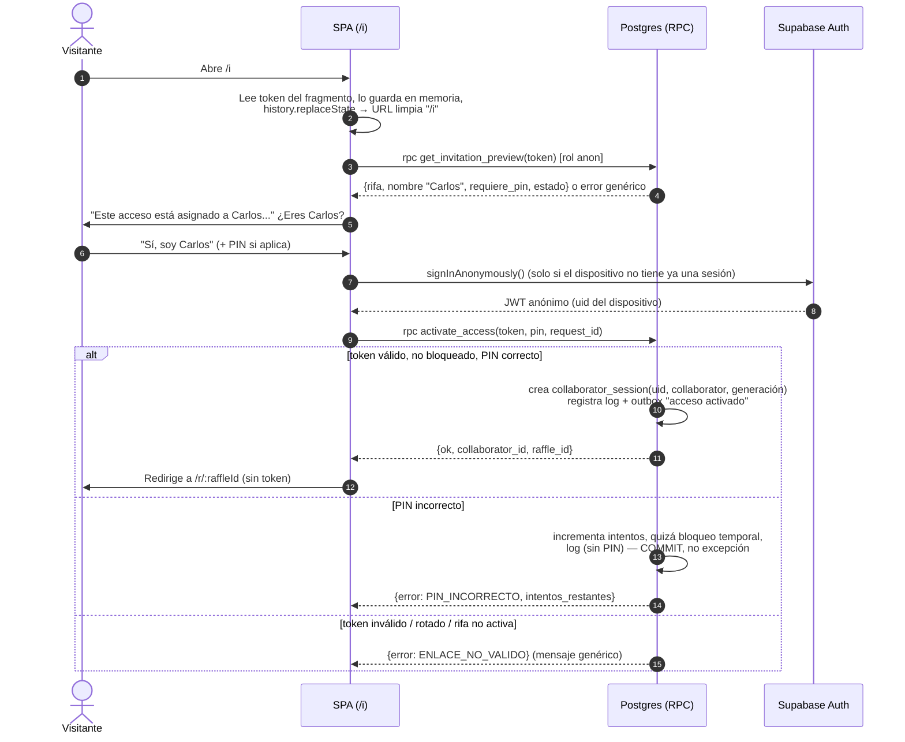

Decisiones clave:

- **El usuario anónimo se crea solo después de que la persona pulsa "Sí, soy…"**, no al cargar la página, para que vistas previas, bots o aperturas accidentales no creen usuarios.
- **Errores genéricos** en el preview (no distinguir "no existe" de "rotado") para no filtrar información.
- **Texto de responsabilidad** obligatorio, con checkbox implícito en el botón: *"Este acceso está asignado a Carlos. Todas las acciones realizadas con este acceso quedarán registradas a nombre de Carlos. No compartas el enlace ni el PIN."* + enlace "¿No eres Carlos?" que explica que debe pedir su propio enlace al organizador.
- **PIN:** 4 casillas grandes, `inputmode="numeric"`, `autocomplete="one-time-code"`, con mensaje claro de intentos restantes.
- **Caso "el creador abre un enlace de colaborador en su propio navegador":** la app usa dos clientes Supabase con `storageKey` distintos (sesión de creador y sesión de dispositivo), así activar un acceso no cierra la sesión del creador. **[REC]** Aun así, mostrar aviso: "Estás conectado como organizador; las acciones con este acceso se registrarán como Carlos".

## 12. Flujo de recuperación o restablecimiento

Tres acciones independientes para el creador, todas registradas en el log y ninguna toca números, ventas ni historial:

| Acción | Efecto en enlace | Efecto en PIN | Efecto en sesiones abiertas | Cuándo usarla |
|---|---|---|---|---|
| **Bloquear / Desbloquear** | Deja de funcionar mientras está bloqueado | — | Inmediatamente sin permiso (RLS) | Sospecha de mal uso, pausa |
| **Generar enlace nuevo** | El anterior deja de funcionar | Opcional: nuevo PIN | Se mantienen | Enlace compartido por error, pero el teléfono de Carlos sigue siendo confiable |
| **Restablecer acceso completo** | Nuevo enlace | Nuevo PIN (si usa PIN) | **Todas revocadas** | Teléfono perdido, cambio de teléfono, compromiso |
| **Cerrar una sesión concreta** | — | — | Esa sesión revocada | "Ese dispositivo ya no es de Carlos" |

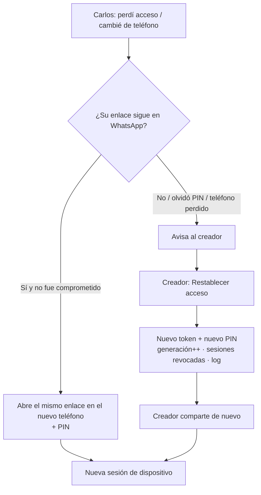

PIN olvidado: no hay "recordar PIN" (no se puede leer). El creador pulsa "Restablecer PIN", ve el nuevo una vez y lo comparte.

## 13. Flujo de distribución en orden

Algoritmo (n = número de colaboradores, ordenados por `position` 1..n):

- `base = floor(100 / n)`, `resto = 100 mod n`.
- **Regla de sobrantes (determinista y documentada): los primeros `resto` colaboradores por posición reciben `base + 1`**; los demás `base`.
- Se asignan bloques contiguos empezando en 00.

Ejemplos:

| n | Tamaños | Rangos |
|---|---|---|
| 1 | 100 | 00–99 |
| 3 | 34, 33, 33 | 00–33, 34–66, 67–99 |
| 7 | 15,15,14,14,14,14,14 | 00–14, 15–29, 30–43, 44–57, 58–71, 72–85, 86–99 |
| 12 | 9×4, 8×8 | 00–08, 09–17, 18–26, 27–35, 36–43, … 92–99 |

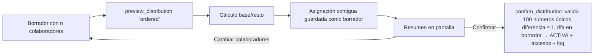

## 14. Flujo de distribución aleatoria

1. **Tamaños:** misma regla que en orden (los primeros `resto` por posición reciben +1). Así el "quién recibe uno más" no depende del azar y es explicable.
2. **Semilla:** el servidor genera 32 bytes aleatorios (`gen_random_bytes`). Nunca la elige el cliente.
3. **Barajado reproducible:** Fisher–Yates sobre `[0..99]` usando como fuente de aleatoriedad `SHA-256(semilla ‖ i)` (PRNG determinista derivado de la semilla). Se documenta como `distribution_algo_version = 1`.
4. **Reparto:** se recorre la permutación y se entregan los primeros `size_1` números al colaborador 1, los siguientes al 2, etc. Cada lista se muestra ordenada ascendentemente.
5. Se guardan **semilla, versión del algoritmo y el resultado**. El resultado almacenado es la fuente de verdad; la semilla sirve para **auditar** ("con esta semilla y este algoritmo cualquiera reproduce exactamente este reparto").
6. En borrador el creador puede "Volver a sortear" (nueva semilla). Cada vista previa queda en el log, así es visible si alguien re-sorteó muchas veces. Tras confirmar, inmutable.

¿Por qué en Postgres y no en el navegador? Porque si el cliente generara la distribución podría enviar cualquier reparto (por ejemplo, darle los números "bonitos" a alguien). El servidor genera y valida; el cliente solo muestra.

## 15. Flujo de venta o reserva

```mermaid
sequenceDiagram
  autonumber
  actor C as Colaborador
  participant UI as SPA
  participant DB as Postgres (RPC sell_number)
  participant RT as Realtime
  C->>UI: Toca número 27 (propio, disponible)
  UI->>C: Panel inferior: nombre*, teléfono*, alias, nota,<br/>[Reservar] [Vendido – pendiente] [Vendido – pagado]
  C->>UI: Pulsa "Vendido – pendiente"
  UI->>UI: Valida (Zod + libphonenumber), genera request_id,<br/>deshabilita botón
  UI->>DB: rpc sell_number(raffle, 27, datos, 'pending', expected_version=3, request_id)
  DB->>DB: ¿request_id ya procesado? → devuelve respuesta guardada
  DB->>DB: Resuelve actor (sesión activa, no bloqueado, rifa activa)
  DB->>DB: SELECT … FOR UPDATE número 27; ¿pertenece a Carlos? ¿version=3? ¿transición válida?
  DB->>DB: INSERT sales · trigger actualiza raffle_numbers (status, version=4)
  DB->>DB: INSERT audit_events · INSERT notification_outbox (si preferencia activa)
  DB->>DB: Guarda respuesta en idempotency_keys · COMMIT
  DB-->>UI: {ok, number: 27, status: pending, version: 4}
  DB-->>RT: cambio en raffle_numbers (sin datos personales)
  RT-->>UI: Todos los clientes de la rifa actualizan el tablero
```

Si `expected_version` no coincide → error `CONFLICTO`: la UI recarga el número y muestra "Este número cambió mientras lo editabas. Revisa el estado actual". Nada se sobrescribe a ciegas.

## 16. Flujo de confirmación de pago

1. Colaborador/creador abre un número `reservado`, `pendiente` o `vencido` propio → "Marcar como pagado".
2. Confirmación: "¿Confirmas que recibiste ₡2 000 de María por el número 27?".
3. `rpc confirm_payment(sale_id, expected_version, request_id)` → `paid_at = now()`, `paid_late = (now > fecha efectiva)`, log, outbox "pago confirmado".
4. Revertir un pago (pagado → pendiente) o cancelar una venta pagada: **solo el creador**, motivo obligatorio, log.

## 17. Flujo de vencimiento

- La fecha límite es una **fecha civil** (`date`) en la zona horaria de la rifa. Vence al final de ese día: el instante de vencimiento es `(fecha + 1 día) a las 00:00` en `raffles.time_zone`.
- Job `process_due_payments()` cada hora (pg_cron): `pendiente` con instante de vencimiento ≤ ahora → `vencido` (actor = Sistema), log, outbox opcional.
- `vencido` **no libera el número automáticamente** (en rifas familiares muchas veces se paga tarde). Desde `vencido`: marcar pagado (con bandera "pagó tarde"), liberar, o el creador extiende la fecha (→ vuelve a `pendiente`).
- Es idempotente: si el job corre dos veces, la segunda no encuentra filas `pendiente` vencidas.

## 18. Flujo de recordatorio tres días antes

Definición exacta: para una venta `pendiente` con fecha efectiva **D** (zona de la rifa), el recordatorio corresponde al día **D − 3** y se emite a partir de las **09:00 hora local** de ese día.

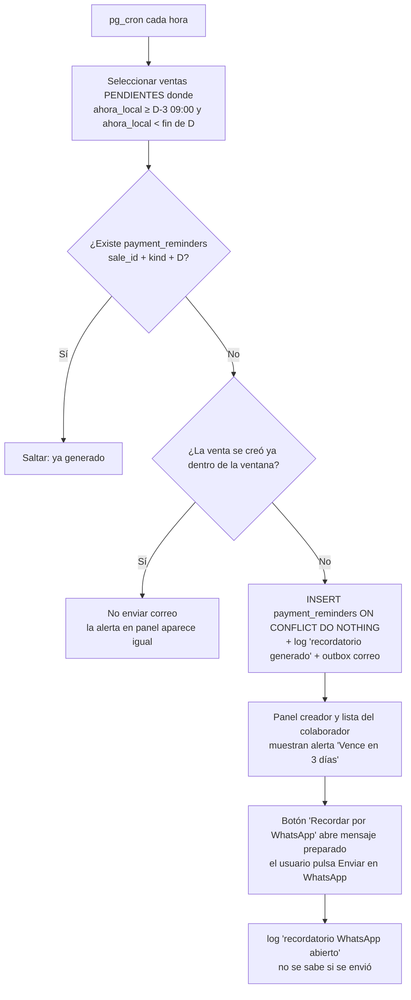

| Pregunta | Comportamiento |
|---|---|
| Zonas horarias | Fechas civiles + `time_zone` IANA de la rifa; cálculos en SQL con `AT TIME ZONE`. Se guarda todo instante como `timestamptz` (UTC). CR no tiene horario de verano, pero el diseño no lo asume. |
| ¿Ya pagado? | La consulta solo toma `pendiente`; si se pagó entre la selección y el envío, el worker re-verifica el estado antes de enviar y descarta (`skipped`). |
| ¿Cambió la fecha? | La clave única incluye D: una fecha nueva genera un recordatorio nuevo; uno pendiente de enviar para la fecha vieja se descarta al re-verificar. |
| Duplicados | `UNIQUE (sale_id, kind, due_date)` + `ON CONFLICT DO NOTHING`. Dos ejecuciones simultáneas no duplican. |
| Job caído | La ventana es un rango, no un instante: la siguiente ejecución recupera todo lo pendiente ("catch-up"). Si el job estuvo caído hasta después de D, ya no tiene sentido recordar; la venta pasa a vencida. |
| Alertas en panel | Se **calculan al consultar** (pendientes con D ≤ hoy+3), no dependen del job. |
| Log | `reminder.generated`, `reminder.email_sent/failed`, `reminder.whatsapp_opened`. |

Plantilla WhatsApp (editable por el creador, con variables `{nombre}`, `{numero}`, `{rifa}`, `{fecha}`, `{monto}`): *"Hola, {nombre}. Te recordamos que está pendiente el pago del número {numero} de la rifa {rifa}. La fecha límite es el {fecha}. Monto: {monto}. Muchas gracias."* `{nombre}` usa el alias si existe. Se genera en el cliente y se abre `https://wa.me/<teléfono E.164 sin +>?text=<texto codificado>`; en Android el sistema permite elegir WhatsApp o WhatsApp Business; en escritorio abre WhatsApp Web/Desktop. Este texto no contiene secretos, así que usar la URL es aceptable.

## 19. Flujo de correo

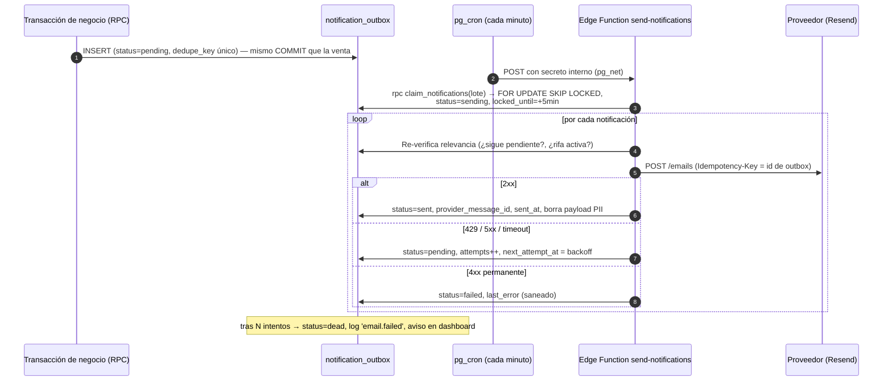

La venta **nunca espera** al correo: la transacción solo inserta una fila.

## 20. Máquina de estados de la rifa

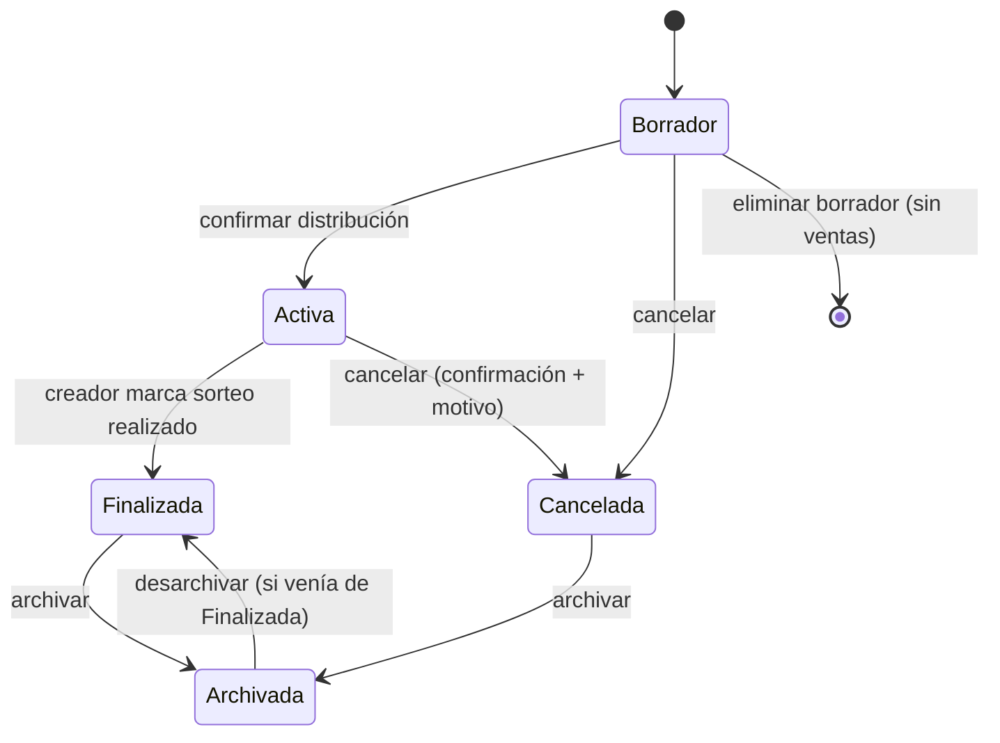

| Estado | Permitido | Bloqueado | Accesos de colaboradores |
|---|---|---|---|
| **Borrador** | Editar todo; colaboradores; vista previa de distribución (re-sorteo); eliminar | Ventas | No existen todavía |
| **Activa** | Ventas, pagos, cancelaciones; editar nombre, descripción, fecha de sorteo, fecha límite, plantilla, preferencias, `show_collaborator_names`; renombrar colaborador; gestionar accesos | Colaboradores (alta/baja), distribución, moneda, **precio** (bloqueado tras la primera venta; las ventas copian su precio) | Se generan al activar; operativos |
| **Finalizada** | Confirmar pagos pendientes/vencidos, cancelar ventas no pagadas, consultar | Nuevas reservas/ventas, cambios estructurales | Solo lectura + confirmar pagos de su lista |
| **Archivada** | Consultar (creador) | Todo cambio; recordatorios y vencimientos se detienen | Revocados (no pueden entrar) |
| **Cancelada** | Consultar, archivar | Todo cambio | Revocados |

- La distribución y los accesos se crean **en la misma transacción** que pasa Borrador → Activa.
- Archivar con pagos pendientes: se permite, con advertencia ("Hay 4 pagos pendientes por ₡8 000; quedarán congelados"). Quedan como `pendiente`/`vencido` en el histórico.
- El log se conserva en todos los estados.
- **Retención [REC]:** 180 días después de archivar, los datos de compradores se anonimizan automáticamente (nombre → "Comprador anonimizado", teléfono/alias/nota → nulos); conteos y montos se conservan.

## 21. Máquina de estados de los números

Separación clave: **el número** tiene un estado público; **la venta** contiene los datos privados y su propio estado. "Cancelada" solo existe en la venta.

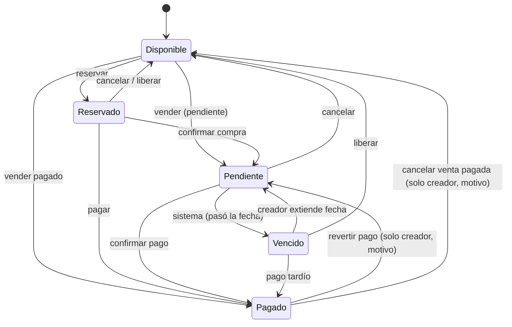

| Transición | Quién | Datos obligatorios |
|---|---|---|
| Disponible → Reservado/Pendiente/Pagado | Dueño de la lista, creador | Nombre y teléfono del comprador; precio copiado de la rifa; si Pagado: `paid_at` |
| Reservado → Pendiente | Dueño, creador | — (hereda comprador) |
| → Pagado | Dueño, creador | `paid_at` (automático), `paid_late` |
| Pendiente → Vencido | **Solo Sistema** | — |
| Vencido → Pendiente | Creador | Nueva fecha propia > hoy |
| → Disponible | Dueño (si no pagado), creador | `ended_reason` (cancelado_por_comprador / liberado / corrección) + `ended_at`; motivo texto si fue pagado |
| Pagado → Pendiente | Creador | Motivo |

**Al volver a Disponible:** la venta pasa a `cancelled` y se desvincula del número (`current_sale_id = null`). Sus datos quedan en la venta histórica (visible al creador y al dueño de la lista) hasta la anonimización. Una nueva venta del mismo número crea **otra fila** de venta: el historial no se sobrescribe.

**Estados imposibles evitados por la BD:**
- Índice único parcial: como máximo una venta activa por `(raffle_id, number)`.
- `CHECK`: `status='available' ⇔ current_sale_id IS NULL`; venta `paid ⇒ paid_at NOT NULL`; venta `cancelled ⇒ ended_at NOT NULL`; nombre y teléfono no nulos salvo venta anonimizada; número entre 0 y 99.
- Las transiciones se validan en una única función SQL (`assert_transition(from, to, actor_kind)`) basada en una tabla de transiciones; el estado del número **se deriva por trigger** desde la venta, así no pueden divergir.
- Los clientes no tienen permisos `INSERT/UPDATE/DELETE` directos: solo pueden llamar funciones.

**Accesibilidad:** cada estado tiene etiqueta de texto + icono + patrón, nunca solo color: Disponible "Libre" (círculo vacío), Reservado "Apartado" (reloj), Pendiente "Por pagar" (moneda con signo), Pagado "Pagado" (check), Vencido "Vencido" (triángulo de alerta).

## 22. Modelo conceptual de datos

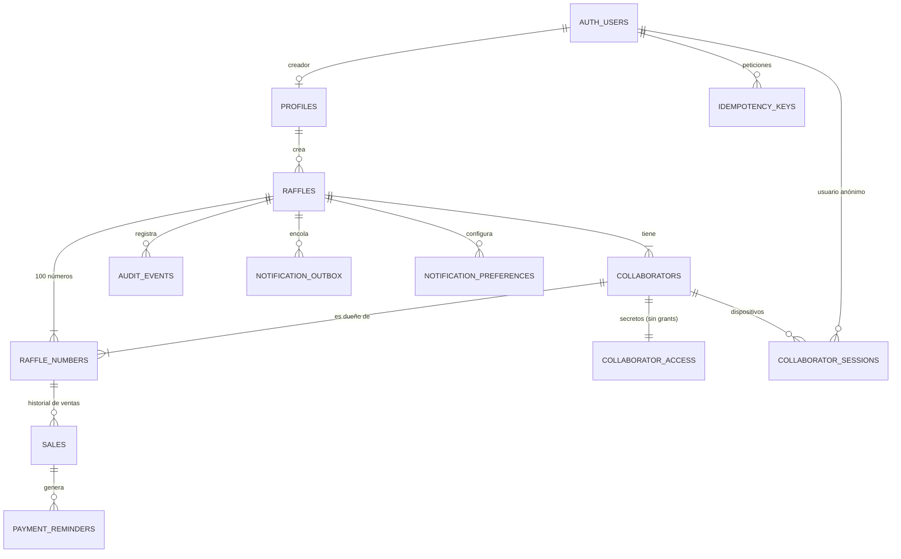

## 23. Propuesta de tablas

Tipos PostgreSQL. `uuid` por defecto `gen_random_uuid()`. Todos los instantes `timestamptz`. Dinero en **unidades menores** (`bigint`) + código ISO 4217 para evitar errores de coma flotante.

**Enums:** `raffle_status` (draft, active, finalized, archived, cancelled) · `distribution_method` (ordered, random) · `number_status` (available, reserved, pending_payment, paid, overdue) · `sale_status` (reserved, pending_payment, paid, overdue, cancelled) · `access_status` (pending_activation, active, blocked) · `actor_type` (creator, collaborator, system) · `outbox_status` (pending, sending, sent, failed, dead, skipped).

**profiles** — `id uuid PK → auth.users`, `display_name text`, `default_time_zone text`, `created_at`.

**raffles**
| Campo | Tipo | Notas |
|---|---|---|
| id | uuid PK | |
| owner_id | uuid FK profiles | |
| name | text | 3–80 caracteres |
| description | text null | ≤ 280 |
| status | raffle_status | default draft |
| number_count | smallint | `CHECK (number_count = 100)` — preparado para el futuro sin implementarlo |
| price_minor | bigint | > 0 |
| currency | char(3) | `CHECK` contra lista permitida (CRC, USD, …) |
| draw_date | date | |
| payment_deadline | date | ≤ draw_date |
| time_zone | text | IANA, validado |
| distribution_method | distribution_method null | |
| distribution_seed | bytea null | solo random |
| distribution_algo_version | smallint null | |
| distribution_confirmed_at | timestamptz null | |
| show_collaborator_names | boolean | default true |
| whatsapp_template | text null | ≤ 500 |
| activated_at / finalized_at / archived_at / cancelled_at | timestamptz null | |
| created_at / updated_at | timestamptz | |
| version | integer | concurrencia optimista de configuración |

**collaborators** — `id`, `raffle_id FK`, `position smallint 1..12` (`UNIQUE(raffle_id, position)`), `display_name text 1..40`, `phone_e164 text null` (`CHECK ~ '^\+[1-9][0-9]{7,14}$'`), `access_status`, `first_activated_at`, `last_activity_at`, `created_at`.

**collaborator_access** (sin ningún `GRANT` a `anon`/`authenticated`) — `collaborator_id PK FK`, `token_hash bytea UNIQUE` (SHA-256), `token_generation integer`, `token_created_at`, `pin_hash text null` (bcrypt), `pin_failed_attempts smallint`, `pin_locked_until timestamptz null`, `pin_lockouts smallint`.

**collaborator_sessions** — `id`, `collaborator_id FK`, `auth_user_id uuid FK auth.users`, `token_generation integer`, `created_at`, `last_seen_at`, `revoked_at null`, `revoked_reason text null`, `device_label text null` (resumen del user-agent: "Android · Chrome"). Índice único parcial `(collaborator_id, auth_user_id) WHERE revoked_at IS NULL`.

**raffle_numbers** (proyección pública, **sin datos personales**) — `raffle_id`, `number smallint CHECK 0..99`, PK `(raffle_id, number)`, `collaborator_id FK`, `status number_status`, `current_sale_id uuid null FK sales`, `version integer`, `updated_at`.

**sales** (datos privados)
| Campo | Tipo | Notas |
|---|---|---|
| id | uuid PK | |
| raffle_id, number | FK compuesta → raffle_numbers | |
| collaborator_id | uuid | dueño de la lista (copiado) |
| status | sale_status | |
| buyer_name | text null | 1–60; null solo si anonimizado |
| buyer_alias | text null | ≤ 30 |
| buyer_phone_e164 | text null | E.164; null solo si anonimizado |
| note | text null | ≤ 140 |
| price_minor / currency | bigint / char(3) | copiados al crear |
| due_date_override | date null | solo creador |
| reserved_at / sold_at / paid_at / ended_at | timestamptz null | |
| paid_late | boolean | |
| ended_reason | text null | enum lógico |
| created_by_actor_type / created_by_user_id / created_by_collaborator_id | | |
| anonymized_at | timestamptz null | |
| version | integer | |

**payment_reminders** — `id`, `sale_id FK`, `kind text ('due_in_3_days')`, `due_date date`, `generated_at`, `UNIQUE(sale_id, kind, due_date)`.

**audit_events** (append-only)
| Campo | Tipo |
|---|---|
| id | bigint identity PK |
| raffle_id | uuid |
| occurred_at | timestamptz default now() |
| actor_type | actor_type |
| actor_user_id | uuid null |
| actor_collaborator_id | uuid null |
| actor_label | text (instantánea: "Carlos", "Administrador (Juan)", "Sistema") |
| collaborator_id | uuid null (lista afectada) |
| action | text (ej. `sale.created`, `access.pin_failed`) |
| number | smallint null |
| sale_id | uuid null |
| from_status / to_status | text null |
| before / after | jsonb null (solo campos no personales; ver §31) |
| result | text (success, denied, failed) |
| request_id | uuid null |
| metadata | jsonb null |

**idempotency_keys** — PK `(actor_user_id, request_id)`, `operation text`, `response jsonb`, `created_at`. Limpieza diaria de > 48 h.

**notification_preferences** — PK `(raffle_id, event_type)`, `enabled boolean`, `include_buyer_phone boolean` (por rifa podría bastar en `raffles`; se decide en Fase 6).

**notification_outbox** — `id uuid PK`, `raffle_id`, `recipient_user_id`, `event_type`, `dedupe_key text UNIQUE`, `payload jsonb` (instantánea para renderizar; se vacía tras envío), `status outbox_status`, `attempts smallint`, `next_attempt_at`, `locked_until`, `last_error text` (saneado), `provider_message_id`, `created_at`, `sent_at`.

**email_daily_usage** — `day date PK`, `sent_count integer` (control de cuota del proveedor).

## 24. Restricciones e índices importantes

- `UNIQUE (raffle_id, position)` en collaborators; `CHECK` 1–12 y trigger que impide >12 por rifa.
- Validación al confirmar distribución: exactamente 100 filas en `raffle_numbers`, números 0–99 sin repetir (PK), tamaños con diferencia ≤ 1.
- `UNIQUE (raffle_id, number) WHERE status <> 'cancelled'` en sales → **una venta activa por número**, la garantía central contra doble venta.
- `UNIQUE (token_hash)`; `UNIQUE (dedupe_key)`; `UNIQUE (sale_id, kind, due_date)`.
- Índices: `raffles(owner_id, status)`; `raffle_numbers(raffle_id, collaborator_id)`; `raffle_numbers(raffle_id, status)`; `sales(raffle_id, collaborator_id, status)`; `sales(status) WHERE status = 'pending_payment'` (jobs); `collaborator_sessions(auth_user_id) WHERE revoked_at IS NULL` (lo usa RLS en cada consulta); `audit_events(raffle_id, occurred_at DESC)`; `audit_events(raffle_id, collaborator_id, occurred_at DESC)`; `notification_outbox(status, next_attempt_at)`.
- Claves foráneas con `ON DELETE CASCADE` desde raffles (borrar un borrador o una cuenta borra todo) excepto `audit_events`, que solo se borra junto con la rifa al eliminar la cuenta.

## 25. Estrategia de Row Level Security

Principios:

1. **RLS activado en todas las tablas** del esquema `public`. Sin políticas = sin acceso.
2. **Lectura con políticas; escritura solo con funciones.** Se revocan `INSERT/UPDATE/DELETE` a `anon` y `authenticated` en todas las tablas. Las mutaciones van por funciones `SECURITY DEFINER` con `SET search_path = ''`, nombres totalmente calificados, y verificaciones explícitas de actor y estado.
3. **RLS filtra filas, no columnas.** Por eso los datos privados están en `sales` y los públicos en `raffle_numbers`. Y los secretos en `collaborator_access`, que no tiene grants.
4. Funciones auxiliares `STABLE SECURITY DEFINER`:
   - `is_raffle_owner(raffle_id)` → `owner_id = auth.uid()` y el JWT **no** es anónimo.
   - `current_collaborator_ids(raffle_id)` → ids de colaborador para los que `auth.uid()` tiene sesión no revocada, con `token_generation` vigente, colaborador no bloqueado y rifa en estado activa/finalizada.

| Tabla | SELECT creador | SELECT colaborador |
|---|---|---|
| raffles | propias | aquellas donde tiene sesión (columnas no sensibles vía vista/RPC; la tabla no tiene datos personales) |
| collaborators | de sus rifas | **solo su propia fila**; los nombres de otros se obtienen vía `rpc get_board()` que respeta `show_collaborator_names` (los teléfonos de colaboradores nunca salen) |
| collaborator_access | ❌ | ❌ |
| collaborator_sessions | de sus rifas | las suyas |
| raffle_numbers | de sus rifas | todas las de la rifa donde participa |
| sales | de sus rifas | `collaborator_id ∈ current_collaborator_ids()` |
| audit_events | de sus rifas | `collaborator_id ∈ current_collaborator_ids()` |
| notification_* , idempotency_keys, payment_reminders | outbox/preferencias de sus rifas (lectura) | ❌ |

`get_invitation_preview(token)` es la **única** función ejecutable por el rol `anon` y devuelve solo nombre de rifa, nombre del colaborador, si requiere PIN y si está disponible.

Riesgos y su control: un `SECURITY DEFINER` mal escrito omite RLS → cada función se prueba con pgTAP para cada rol (creador dueño, otro creador, colaborador dueño, otro colaborador, colaborador bloqueado, anónimo sin sesión). Además, `supabase db lint` / Security Advisor antes de cada publicación.

## 26. Estrategia de sesiones para colaboradores sin cuenta

**Opción elegida: Supabase Anonymous Sign-Ins + tabla `collaborator_sessions`.**

| Opción | Ventajas | Inconvenientes |
|---|---|---|
| **A. Usuario anónimo de Supabase** (elegida) | JWT real gestionado por Supabase (refresco, expiración); RLS y Realtime funcionan con `auth.uid()` sin infraestructura extra; revocación inmediata vía tabla | Hay que activarlo en el proyecto; acumula usuarios anónimos (limpieza programada); el límite de tasa de inicios anónimos por IP es configurable y debe revisarse en el panel; recomendable CAPTCHA (Turnstile) en producción |
| B. Token de sesión propio + todo vía Edge Functions con clave secreta | Control total | Se pierde RLS como defensa (todo corre como administrador); Realtime privado se complica; mucho más código de seguridad propio |
| C. Firmar JWT propios con el secreto del proyecto | RLS nativo | Manejar el secreto de firma, rotación y el cambio de Supabase hacia claves asimétricas; error grave si se filtra |

Detalles:

- **Un usuario anónimo = un navegador/dispositivo**, no una persona. Puede tener sesiones con varios colaboradores (Carlos colabora en dos rifas, o una abuela gestiona su lista y la de su nieta desde el mismo teléfono). La UI permite elegir "¿Con qué acceso quieres trabajar?" y cada RPC recibe `collaborator_id` explícito, que la función verifica contra las sesiones.
- **Revocación real:** el JWT anónimo puede seguir siendo válido criptográficamente, pero RLS y las funciones consultan `collaborator_sessions` en cada petición → sin datos ni acciones de inmediato.
- **Límite:** máximo 5 sesiones activas por colaborador; la 6.ª revoca la más antigua (log + visible al creador).
- **Inactividad:** sesiones sin uso en 60 días se revocan; usuarios anónimos sin sesiones activas se eliminan a los 30 días (job).
- **Persistencia en el navegador:** `localStorage` (por defecto en supabase-js). Safari puede borrar almacenamiento de sitios no visitados en 7 días; mitigación: el enlace sigue sirviendo + **[REC]** manifiesto PWA mínimo para "Añadir a pantalla de inicio".
- **Rifa archivada/cancelada:** las sesiones dejan de valer por la condición de estado en `current_collaborator_ids`.

## 27. Diseño de tokens y PIN

**Token de invitación**
- 32 bytes de `gen_random_bytes` (256 bits) codificados base64url (~43 caracteres). Enumerar es inviable; aun así el preview tiene respuestas genéricas.
- Se guarda **solo `SHA-256(token)`**. Un hash rápido es correcto aquí porque el token tiene alta entropía (no es una contraseña).
- Se muestra en claro **solo** en la respuesta de la función que lo genera (activar rifa, rotar enlace) y en la pantalla de compartir. Si el creador lo pierde → "Generar enlace nuevo".
- `token_generation` se incrementa en cada rotación; las sesiones guardan la generación con la que se crearon (permite "rotar y revocar" o "rotar sin revocar").
- Vigencia: hasta rotación, bloqueo, o fin de la rifa (finalizada → solo lectura/pagos; archivada → inválido).
- Nunca en logs, analítica, correos ni en el path/query de la URL de la app.

**PIN**
- 4 dígitos. **[REC] Generado por el sistema** (evita 0000, 1234, fechas); el creador puede escribir uno propio, con rechazo de PINs triviales.
- Hash con bcrypt (`pgcrypto crypt(pin, gen_salt('bf'))`). **Honestidad técnica:** con solo 10 000 combinaciones, un hash filtrado se rompe en segundos; el hash evita lectura casual, pero la protección real es (a) el PIN es inútil sin el token y (b) el límite de intentos en línea.
- Límite de intentos (por acceso, en BD): 5 fallos → bloqueo 15 min; cada bloqueo posterior duplica el tiempo; tras 4 bloqueos → bloqueo hasta que el creador restablezca. Estimación: sin esto 10 000 intentos tardan minutos; con esto, decenas de días y con aviso al creador.
- **Detalle de implementación importante:** el PIN incorrecto **no** debe lanzar excepción en la función (revertiría el contador y el log). Devuelve un resultado de error y confirma la transacción.
- Se registran en el log: fallo de PIN (sin el valor), bloqueo temporal, bloqueo definitivo. Notificación al creador cuando hay un bloqueo.
- UX: si la rifa no usa PIN, el paso no aparece. Mensajes: "PIN incorrecto. Te quedan 2 intentos." / "Demasiados intentos. Intenta de nuevo a las 15:42 o pide al organizador un PIN nuevo."

## 28. Estrategia de concurrencia e idempotencia

Tres capas, de la más débil a la más fuerte:

1. **UI:** botón deshabilitado durante el envío, indicador "Guardando…". Solo mejora la experiencia; no es una garantía.
2. **Idempotencia:** cada intención de cambio genera un `request_id` (UUID) **al abrir el formulario de confirmación** y se reutiliza en cualquier reintento. La función busca `(actor, request_id)` en `idempotency_keys`; si existe, devuelve la respuesta original sin repetir el efecto. Cubre doble toque, reintentos por red lenta y "¿se guardó o no?".
3. **Concurrencia optimista + bloqueo de fila:** cada mutación envía `expected_version` del número; la función hace `SELECT … FOR UPDATE` (serializa a quien llegue a la vez), compara versión y valida transición. Si alguien cambió antes → `CONFLICTO` con el estado actual. Respaldo final: el índice único parcial de ventas activas.

| Escenario | Qué lo detiene |
|---|---|
| Doble toque | request_id igual → idempotencia |
| Dos pestañas, misma acción | request_id distintos → la segunda recibe CONFLICTO (versión) |
| Móvil y PC con la misma sesión | Igual que dos pestañas |
| Creador y colaborador a la vez | `FOR UPDATE` + versión: gana el primero; el segundo ve el cambio y decide |
| Petición repetida por la red | Idempotencia |
| Información desactualizada | Versión obsoleta → CONFLICTO; además refetch al reconectar |

Errores tipados desde SQL (`R4A_CONFLICT`, `R4A_FORBIDDEN`, `R4A_INVALID_TRANSITION`, `R4A_RAFFLE_NOT_ACTIVE`, `R4A_ACCESS_BLOCKED`, `R4A_VALIDATION`) mapeados en TypeScript a una unión discriminada `AppError` y a mensajes en español en un único lugar.

## 29. Estrategia de tiempo real

- **Supabase Realtime – Postgres Changes** sobre `raffle_numbers` (filtrado por `raffle_id`) y `collaborators` (para el creador). Con RLS activo, Realtime solo entrega cambios de filas que el suscriptor puede leer. Como `raffle_numbers` no contiene datos personales, se puede difundir a todos los participantes sin riesgo.
- Limitaciones a conocer (del proveedor): los eventos `DELETE` no se filtran por RLS → **no se borran filas** de estas tablas (no se hace). Postgres Changes evalúa permisos por suscriptor y escala peor que Broadcast; para ≤13 participantes por rifa es irrelevante. **[FUT]** migrar a Broadcast desde la BD si crece.
- **Realtime es una señal, no la fuente de verdad:** al recibir un evento la app actualiza la caché de TanStack Query y, para datos privados (venta propia), **vuelve a consultar** con RLS. Al reconectar, al volver a la pestaña (`visibilitychange`) y al recuperar red, refetch completo.
- Indicador visible "En vivo / Reconectando…".
- Colaborador bloqueado: su siguiente consulta/RPC devuelve `R4A_ACCESS_BLOCKED` → pantalla "Tu acceso fue pausado por el organizador".

## 30. Estrategia de correo y reintentos

**Comparativa de proveedores** (límites del plan gratuito según mi conocimiento; **verificar en sus páginas antes de la Fase 6**, cambian con frecuencia):

| Proveedor | Plan gratuito aprox. | A favor | En contra |
|---|---|---|---|
| **Resend** (recomendado) | ~3 000/mes y ~100/día; 1 dominio | API simple, buen SDK, soporta cabecera de idempotencia, SMTP para Supabase Auth | Límite diario bajo; requiere dominio |
| Brevo | ~300/día | Cuota diaria mayor | Interfaz más orientada a marketing; marca en plan gratuito |
| Amazon SES | Muy barato por uso, no gratuito indefinido | Escala y precio | Cuenta AWS, salir del sandbox, más configuración |
| Postmark | Solo cuota de prueba pequeña | Excelente entregabilidad | Básicamente de pago |
| Mailgun | Plan gratuito muy limitado | — | Límites bajos |

**Estimación de volumen:** una rifa completa ≈ 100 ventas + ~100 pagos + recordatorios + activaciones ≈ 250 correos, concentrados en pocos días. Con ~100/día un creador muy activo, o varios a la vez, agotan la cuota. Mitigaciones:
- Preferencias por tipo de evento (por defecto: venta ✅, pago ✅, cancelación ✅, recordatorio ✅, activación ✅, liberación ❌, bloqueo ✅).
- Contador `email_daily_usage`: al acercarse al límite, los correos no críticos se **posponen** al día siguiente (no se pierden) y el dashboard lo indica.
- **[FUT]** modo resumen diario.
- Límite por creador (p. ej. 150/día) para evitar abuso.

**Auth de Supabase:** el SMTP integrado de Supabase es solo para pruebas (muy pocos correos por hora). Para confirmación y recuperación de contraseña en producción hay que configurar **SMTP propio** (el mismo proveedor). Esto afecta a la Fase 3 en producción, no en local (local usa el capturador de correos de la CLI).

**Mecánica:**
- *Idempotencia:* `dedupe_key` único por evento (p. ej. `sale.paid:<sale_id>:<sale_version>`) impide encolar dos veces; el id de outbox se envía como clave de idempotencia al proveedor, lo que cubre el caso "se envió pero el worker murió antes de marcarlo".
- *Entrega:* al-menos-una-vez con deduplicación → en la práctica, exactamente una.
- *Reintentos:* backoff exponencial con jitter (1, 5, 15, 60 min, 6 h); máximo 6 intentos → `dead`.
- *Clasificación de errores:* 429/5xx/timeout = reintentar; 4xx de validación = `failed` inmediato.
- *Ritmo:* lotes pequeños (p. ej. 20) y envío secuencial para respetar el límite por segundo del proveedor.
- *Bloqueos:* `locked_until` libera trabajos de un worker caído.
- *Registro:* cada envío o fallo definitivo genera evento en el log; el dashboard muestra "3 correos no se pudieron enviar".
- *Privacidad:* `last_error` sin cuerpos ni datos personales; `payload` se vacía tras enviar; el correo enlaza al panel (`/r/:id`), nunca a un acceso de colaborador.
- *Activación del worker:* `pg_cron` cada minuto llama a la Edge Function con `pg_net`, autenticándose con un secreto guardado en Supabase Vault. Latencia máxima ~1 min, suficiente.

## 31. Diseño del log append-only

**Decisión: registro explícito desde las funciones de base de datos, en la misma transacción que el cambio, sobre una tabla append-only protegida por permisos y trigger.**

| Opción | Evaluación |
|---|---|
| Solo frontend | ❌ Se puede omitir, falsificar (cualquiera puede llamar a la API), se pierde si la red falla después del cambio, y no hay atomicidad con la acción |
| Edge Function/backend | Mejor, pero si la mutación ocurre en la BD y el log en otro proceso, pueden divergir |
| Triggers genéricos | Atómicos, pero no conocen la *intención* ("liberar" vs "cancelar") ni el `request_id` |
| **Funciones de BD (elegida)** | Atómicas con el cambio, conocen el actor, la intención y el request_id |

Protecciones:
- `REVOKE INSERT, UPDATE, DELETE, TRUNCATE` para `anon` y `authenticated`. Solo las funciones insertan.
- Trigger `BEFORE UPDATE OR DELETE` que lanza excepción (protege también contra errores con la clave secreta). Excepción documentada: borrado en cascada al eliminar la cuenta.
- **Límite honesto:** el propietario de la base de datos (tú, en el panel de Supabase) puede desactivar el trigger. La garantía es "inmutable desde la aplicación". **[FUT]** encadenamiento hash para evidenciar manipulación.

Qué guarda `before/after`: estados, versiones, fecha de vencimiento, precio, motivo, nombre de colaborador. **No guarda** nombre, alias, teléfono ni nota del comprador; la interfaz los une por `sale_id` respetando RLS (y tras anonimizar se muestra "Comprador anonimizado"). Nunca token, hash, PIN ni cabeceras.

Eventos (`action`): `raffle.created/updated/activated/finalized/archived/unarchived/cancelled`, `collaborator.created/renamed`, `distribution.previewed/confirmed`, `access.generated/activated/pin_failed/pin_locked/blocked/unblocked/link_rotated/pin_reset/session_revoked/sessions_revoked`, `sale.reserved/sold/payment_confirmed/payment_reverted/cancelled/released/overdue/due_date_changed/buyer_updated`, `reminder.generated/whatsapp_opened`, `email.sent/failed`, `settings.notifications_updated`.

Acciones denegadas: las funciones que rechazan por permiso lanzan excepción (no se registra, para no permitir llenar el log). Solo se registran intencionalmente los fallos de PIN.

Presentación: el log se muestra en lenguaje natural — "Carlos registró la venta del número 27", "Administrador (Juan) revirtió el pago del número 12 · Motivo: error".

## 32. Arquitectura propuesta

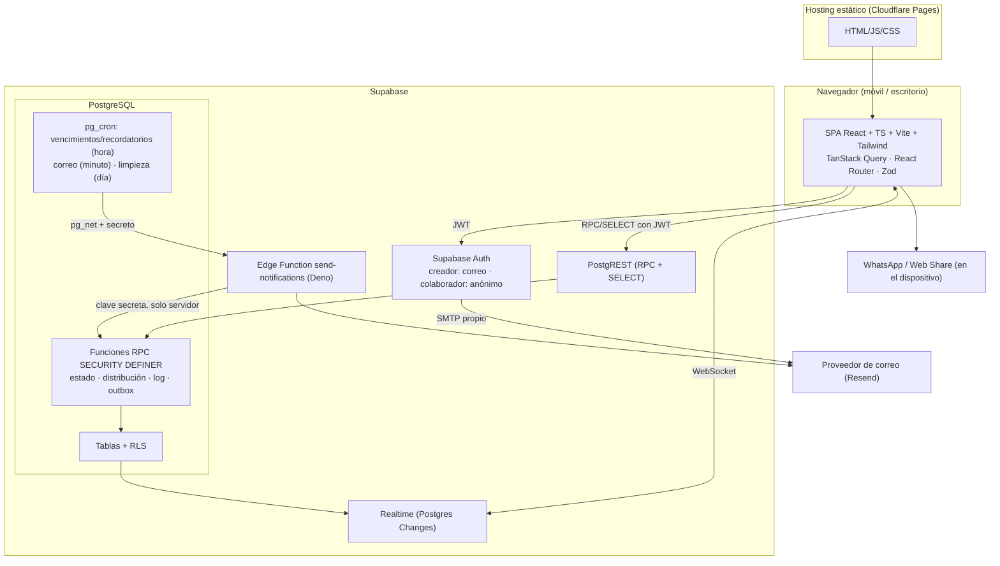

**Tecnologías añadidas y su justificación:**

| Añadido | Problema que resuelve | Alternativa | Coste |
|---|---|---|---|
| **Zod** | Validar formularios y respuestas con tipos inferidos | Validación manual | Bajo |
| **TanStack Query** | Caché del servidor, refetch al reconectar, invalidación desde Realtime, estados de carga | `useEffect` + estado manual (propenso a errores) | Bajo-medio |
| **React Router** | Rutas `/i`, `/r/:id`, panel | Otra librería de rutas | Bajo |
| **libphonenumber-js** (metadatos mínimos) | Validar y normalizar teléfonos a E.164 | Regex (falla con muchos formatos) | ~bundle pequeño |
| **Supabase CLI + Docker** | BD local, migraciones, `supabase test db` | Trabajar contra la nube (peligroso) | Docker Desktop en Windows (WSL2) |
| **pgTAP** | Probar RLS y funciones SQL | Probar solo desde TS | Bajo; viene con la CLI |
| **@axe-core/playwright** | Pruebas automáticas de accesibilidad | Revisión manual | Bajo |
| **Cloudflare Pages** (hosting) | SPA estática gratis con previews por PR | Vercel, Netlify | Gratis |
| **Turnstile** [REC, Fase 8] | Abuso en registro e inicios anónimos; integrado en Supabase Auth | hCaptcha | Gratis, algo de fricción |

Sin librería de fechas: `Intl.DateTimeFormat` en cliente y cálculos de zona horaria en SQL. Sin React Hook Form al inicio: formularios de 2–4 campos; se reevalúa si aparecen formularios complejos.

**Límites del plan gratuito de Supabase a vigilar** (verificar en su web): el proyecto se **pausa tras ~7 días sin actividad** (relevante para un portafolio: hay que reactivarlo o tener tráfico), ~500 MB de base de datos, 2 proyectos gratuitos, cuotas de Edge Functions y de conexiones/mensajes de Realtime, sin copias de seguridad descargables en el plan gratuito.

## 33. Diagrama de dependencias

Las flechas indican "depende de". El dominio no depende de nada externo.

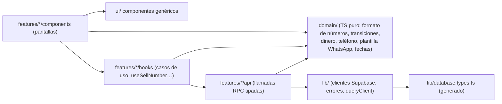

Regla: `domain/` no importa React ni Supabase (se prueba con Vitest puro). `features/` no importa de otra feature salvo a través de su `index.ts`. La "capa de aplicación" son los hooks; no creo repositorios ni inyección de dependencias porque Supabase ya es la abstracción y añadir otra no aporta.

## 34. Estructura de carpetas

```
rifas4all/
├─ .github/workflows/           ci.yml, e2e.yml
├─ docs/
│  ├─ diseno-tecnico.md         (este documento)
│  └─ adr/                      0001-supabase.md, 0002-sesiones-anonimas.md,
│                               0003-log-en-bd.md, 0004-outbox.md, …
├─ supabase/
│  ├─ config.toml
│  ├─ migrations/               SQL versionado (tablas, RLS, funciones, cron)
│  ├─ seed.sql                  datos de prueba locales
│  ├─ tests/                    pgTAP: rls_*.sql, rpc_*.sql, distribution.sql
│  └─ functions/
│     ├─ _shared/               cliente, render de correos, errores
│     └─ send-notifications/
├─ src/
│  ├─ app/                      router, providers, layout, error boundary
│  ├─ domain/                   lógica pura + tests *.test.ts
│  ├─ features/
│  │  ├─ auth/  raffles/  collaborators/  invitation/
│  │  ├─ board/  sales/  reminders/  activity-log/
│  │  ├─ dashboard/  notifications/
│  │  └─ (cada una: api.ts, hooks/, components/, index.ts)
│  ├─ lib/                      supabase.ts (2 clientes), errors.ts, query.ts, env.ts
│  ├─ ui/                       Button, BottomSheet, StatusBadge, NumberGrid…
│  └─ main.tsx
├─ tests/
│  ├─ integration/              Vitest contra Supabase local (roles reales)
│  └─ e2e/                      Playwright
├─ .env.example                 solo variables públicas VITE_*
└─ README.md
```

## 35. Estrategia de testing

| Nivel | Herramienta | Qué cubre | Prioridad |
|---|---|---|---|
| Unitario | Vitest | `domain/`: formato 00–99, tamaños de distribución, tabla de transiciones (espejo para la UI), dinero, normalización de teléfono, plantilla WhatsApp, cálculo de "vence en N días" | Alta |
| Base de datos | **pgTAP** (`supabase test db`) | **RLS por rol** (6 perfiles de actor), cada RPC: transiciones válidas/ inválidas, idempotencia, conflicto de versión, distribución (100 únicos, diferencia ≤ 1, reproducibilidad con semilla), PIN y bloqueo, inmutabilidad del log, jobs (vencimiento, recordatorios sin duplicados) | **Máxima**: aquí vive la seguridad |
| Integración | Vitest + supabase-js contra stack local | Flujo real con JWT de creador y anónimo; concurrencia (dos llamadas en paralelo → una gana); contrato TS↔SQL de errores | Alta |
| Componentes | Testing Library | Panel inferior, cuadrícula accesible (roles, etiquetas), formularios y mensajes de error | Media |
| Edge Function | `deno test` | Clasificación de errores, backoff, saneado; proveedor simulado | Media |
| E2E | Playwright (2 contextos de navegador) | Creador crea y activa rifa → colaborador activa con PIN → vende → creador lo ve en tiempo real; bloqueo; conflicto | Media (pocos, valiosos) |
| Accesibilidad | axe + Playwright, viewport móvil | Pantallas principales sin violaciones serias | Media |

**Prueba de contrato:** la tabla de transiciones existe en SQL (autoridad) y en TS (para mostrar botones). Un test de integración recorre todas las combinaciones contra la BD y verifica que coinciden; así la duplicación queda controlada.

**CI (GitHub Actions):** en cada PR → instalar, lint, typecheck, unitarios, `supabase start` + `supabase db reset` + pgTAP + integración, build. E2E en PR a `main` (o nightly si es lento). Despliegue de migraciones a producción **manual** (job con aprobación), nunca automático en la Fase 1.

## 36. Casos límite

| Caso | Comportamiento esperado | Dónde se protege |
|---|---|---|
| 1 colaborador | Recibe 00–99; filtro "Mis números" = todos | Función de distribución |
| 12 colaboradores | 4 con 9 números, 8 con 8 | Función + pgTAP |
| División no exacta | Primeros `100 mod n` por posición reciben +1 | Función documentada |
| Dos pestañas mismo número | Una gana; la otra recibe CONFLICTO y ve el estado nuevo | `FOR UPDATE` + versión + índice único |
| Doble toque en Guardar | Un solo efecto, misma respuesta | `request_id` + botón deshabilitado |
| Admin y colaborador simultáneos | Igual que dos pestañas; el log muestra ambos intentos efectivos | BD |
| Colaborador bloqueado con app abierta | Siguiente acción falla con "acceso pausado"; datos privados dejan de cargarse | RLS + funciones |
| Enlace compartido con otra persona | Si tiene el PIN, entra y actúa **como Carlos** (advertido); el creador ve un dispositivo nuevo y puede revocar | Advertencia UX + sesiones visibles + log |
| PIN incorrecto varias veces | Contador, bloqueo temporal progresivo, aviso al creador | Función de activación (sin excepción) |
| PIN olvidado | Creador restablece; se muestra una vez | Función + UX |
| Pérdida del teléfono | Creador "Restablecer acceso": nuevas credenciales, sesiones revocadas, datos intactos | Funciones de acceso |
| Cambio de teléfono | Abre el mismo enlace (+PIN) en el nuevo; o restablecimiento | Token reutilizable |
| Sesión borrada (datos del navegador) | Reabrir el enlace → nueva sesión | Token reutilizable |
| Acceso restablecido | Enlace viejo: "Este enlace ya no es válido, pide uno nuevo" | Generación del token |
| Correo duplicado | Imposible por `dedupe_key` + idempotencia del proveedor | Outbox |
| Proveedor caído | Reintentos con backoff; venta no afectada; tras agotar, `dead` y aviso | Outbox + worker |
| Job de recordatorios dos veces | `ON CONFLICT DO NOTHING` | Índice único |
| Cambio de fecha límite | Ventas sin fecha propia la heredan; recordatorio recalculado; vencidas con fecha nueva futura vuelven a pendiente | Fecha efectiva + job |
| Pago después del vencimiento | Vencido → Pagado con `paid_late = true` | Transiciones |
| Número cancelado y vendido de nuevo | Nueva fila de venta; historial intacto | Modelo venta ≠ número |
| Rifa archivada con pagos pendientes | Advertencia; quedan congelados; sin recordatorios | Estado de rifa |
| Teléfono inválido | Mensaje claro en el formulario; la BD rechaza no-E.164 | Cliente (libphonenumber) + `CHECK` |
| Colaborador sin actividad | "Sin activar" / "Última actividad hace 9 días" en el panel; sin juicio de rendimiento | `last_activity_at` |
| Conexión intermitente | Banner "Sin conexión", acciones deshabilitadas, reintento con mismo `request_id`, refetch al volver | TanStack Query + idempotencia |
| Cambio aplicado pero UI no actualizada | La respuesta del RPC actualiza la caché; Realtime y refetch al enfocar corrigen | Cliente |
| Creador abre enlace de colaborador en su navegador | Clientes con almacenamiento separado; aviso visible | Cliente |
| Mismo teléfono para dos colaboradores | Selector de acceso activo; cada acción indica a nombre de quién | Sesiones múltiples por dispositivo |
| Vista previa de enlace de WhatsApp | No ve el token (fragmento) ni crea sesiones (requiere confirmación) | Diseño de URL |

## 37. Riesgos técnicos

| Riesgo | Prob. | Impacto | Mitigación |
|---|---|---|---|
| Error en una política RLS o función `SECURITY DEFINER` expone datos | Media | Alto | Escritura solo por funciones, `search_path` fijo, pgTAP por rol, Security Advisor, revisión |
| Cuotas de correo agotadas | Alta | Medio | Preferencias, cuota diaria, posposición, dominio verificado |
| Pausa del proyecto Supabase gratuito | Alta | Medio | Documentarlo; plan de pago si hay usuarios reales |
| Usuarios anónimos acumulados / abuso | Media | Medio | Crear solo tras confirmación, límite de tasa, Turnstile, limpieza |
| Almacenamiento borrado (Safari, navegador interno de WhatsApp) | Alta | Bajo | Token reutilizable, PWA, mensaje claro |
| Divergencia entre transiciones TS y SQL | Media | Bajo | Prueba de contrato |
| Zona horaria mal calculada | Media | Medio | Todo en SQL con IANA; tests en fronteras de día |
| Docker/WSL en Windows complica el entorno | Media | Bajo | Guía en README, Fase 1 lo valida |
| Cambios de API del proveedor | Baja | Medio | Adaptador pequeño en `_shared` |
| Sobreingeniería | Media | Medio | Cada abstracción justificada en ADR |

## 38. Riesgos de privacidad

- Se almacenan **nombres y teléfonos reales de terceros** (compradores) que no aceptaron términos de la app. El creador actúa como responsable de esos datos; la app es encargada. Hay que informarlo.
- Exposición entre colaboradores (mitigado por tabla separada y RLS).
- PII en correos (bandejas de entrada y logs del proveedor).
- PII en logs técnicos/errores de Edge Functions o del navegador.
- Enlaces compartidos en grupos de WhatsApp (un enlace en un grupo = cualquiera del grupo puede entrar si no hay PIN).
- Retención indefinida.
- Marco legal: en Costa Rica aplica la Ley 8968 de Protección de la Persona frente al Tratamiento de sus Datos Personales; no soy asesor legal, pero el diseño debe facilitar consentimiento informado del creador, minimización, acceso y supresión.

## 39. Medidas de mitigación (privacidad y seguridad)

1. Minimización: solo nombre, teléfono, alias y nota (≤140, con aviso "No escribas datos sensibles"). Nada de cédula ni dirección.
2. Tabla `sales` aislada; `raffle_numbers` sin PII; secretos en tabla sin grants.
3. Anonimización automática 180 días tras archivar; borrado completo al eliminar la cuenta; botón "Anonimizar compradores ahora" para el creador.
4. Correo: opción de ocultar teléfono; sin enlaces de acceso; payload vaciado tras enviar.
5. Errores: mensajes al usuario genéricos; logs con códigos e ids, nunca cuerpos ni datos personales; sin analítica de terceros en el MVP (si se añade, sin URLs con fragmento ni PII).
6. Recomendación de PIN cuando el enlace se comparte en un grupo (aviso en la pantalla de compartir).
7. Página de privacidad y términos sencillos; casilla de aceptación en el registro del creador.
8. Cabeceras de seguridad en el hosting: CSP estricta, `Referrer-Policy: no-referrer`, `X-Content-Type-Options`, `frame-ancestors 'none'`, HSTS.
9. Variables: el frontend solo recibe URL y clave **publicable** de Supabase (diseñada para ser pública; la seguridad la da RLS). La clave **secreta**/service role y la API key del correo solo en secretos de Edge Functions; `.env` en `.gitignore`; escaneo de secretos de GitHub activado.
10. Rate limiting: límites de Supabase Auth; intentos de PIN en BD; límite de rifas activas por creador (p. ej. 10) y de correos por creador/día.

## 40. Plan de implementación por fases

Mantengo tu secuencia, con entregables verificables:

| Fase | Entregable verificable | Riesgo que elimina |
|---|---|---|
| 1. Fundaciones | Repo, Vite+TS estricto, ESLint+Prettier, Vitest, Playwright vacío, Supabase CLI local funcionando, `.env.example`, CI con lint/typecheck/test, README inicial, ADR-0001 | Entorno Windows/Docker |
| 2. Modelo de datos | Migraciones de todas las tablas, enums, restricciones, índices, RLS, funciones auxiliares, distribución, tabla de transiciones, log, seed; pgTAP en verde | La seguridad entera |
| 3. Creador | Registro/login/recuperación, CRUD de rifa en borrador, rutas protegidas | Auth |
| 4. Colaboradores y accesos | Alta de colaboradores, vista previa y confirmación de distribución, compartir, activación anónima + PIN, gestión de accesos | Identidad del colaborador |
| 5. Tablero y ventas | Cuadrícula accesible, panel inferior, todas las transiciones, idempotencia, conflicto, tiempo real | Integridad y concurrencia |
| 6. Notificaciones | Outbox, Edge Function, cron, preferencias, recordatorios, WhatsApp, SMTP para Auth | Correo fiable |
| 7. Administración | Dashboard, log legible, estadísticas, finalizar/archivar/cancelar, anonimización | Ciclo de vida |
| 8. Calidad y publicación | E2E, axe, rendimiento en móvil lento, CSP, Turnstile, revisión de seguridad, README final, despliegue | Publicable |

Cada fase: objetivo, archivos, cambios pequeños, comandos exactos, pruebas, validación manual, y **espero tu resultado antes de seguir**.

## 41. Criterios de aceptación del MVP

1. Un creador puede registrarse, confirmar correo, recuperar contraseña y crear una rifa completa desde un teléfono en < 3 minutos.
2. Con n ∈ {1..12}, la distribución reparte exactamente 00–99 sin repetidos, con diferencia ≤ 1, siguiendo la regla de sobrantes; la aleatoria es reproducible con su semilla.
3. Un colaborador activa su acceso desde WhatsApp sin crear cuenta, con o sin PIN; el token no queda en la barra de direcciones.
4. Un colaborador **no puede** (probado a nivel de API, no solo de UI) leer compradores ajenos, modificar números ajenos, ni acceder a otras rifas.
5. Bloquear o restablecer un acceso surte efecto en la siguiente petición y no altera ventas ni historial.
6. Ninguna combinación de doble envío, pestañas o roles simultáneos produce dos ventas activas para un número.
7. Los cambios de estado aparecen en otros dispositivos en ≤ 3 s en condiciones normales, y se reconcilian al reconectar.
8. Cada venta (y los demás eventos activados) genera exactamente un correo al creador; un fallo del proveedor no bloquea ni pierde eventos.
9. El recordatorio de 3 días se genera una sola vez por venta y fecha, y el mensaje WhatsApp se abre prellenado sin enviarse solo.
10. Toda acción de la lista del §31 aparece en el log; el log no contiene PIN, tokens ni datos de compradores, y no puede modificarse vía API.
11. Las pantallas principales no tienen violaciones axe serias, funcionan con teclado y lector de pantalla, y los estados no dependen solo del color.
12. CI en verde: unitarios, pgTAP, integración, E2E del flujo principal.

## 42. Checklist antes de publicar

- [ ] RLS activo en todas las tablas; Security Advisor de Supabase sin alertas críticas.
- [ ] Ningún grant de escritura directa a `anon`/`authenticated`.
- [ ] Todas las funciones `SECURITY DEFINER` con `search_path = ''` y probadas por rol.
- [ ] Clave secreta y API key de correo solo en secretos del servidor; historial de git sin secretos.
- [ ] Inicio anónimo activado con límite de tasa revisado; CAPTCHA decidido.
- [ ] SMTP propio configurado para Auth; dominio con SPF, DKIM y DMARC.
- [ ] Plantillas de correo revisadas: sin tokens, PIN ni enlaces de acceso.
- [ ] Jobs de cron activos y probados (vencimiento, recordatorios, correo, limpieza, anonimización).
- [ ] Cabeceras de seguridad y CSP en el hosting; reescritura SPA para rutas.
- [ ] Política de privacidad y términos publicados.
- [ ] Prueba manual en Android (Chrome y navegador interno de WhatsApp) e iOS (Safari).
- [ ] Prueba con conexión lenta (throttling 3G) y sin conexión.
- [ ] Copia de seguridad / exportación de esquema documentada.
- [ ] README con arquitectura, cómo ejecutar, cómo probar, decisiones y limitaciones conocidas (incluida "la app no verifica a la persona física").

## 43. Preguntas que necesito que respondas

Ver §A.4: **P1** (semántica de Reservado vs Pendiente), **P2** (dominio propio para el correo), **P3** (colaborador puede marcar pagado; solo el creador revierte). Ninguna bloquea el inicio de la Fase 1.

Suposiciones no bloqueantes adoptadas (corrígeme si alguna no te sirve): retención de 180 días; máximo 5 dispositivos por colaborador; recordatorio a las 09:00 hora local; PIN generado por el sistema; `vencido` no libera el número automáticamente; precio bloqueado tras la primera venta; `show_collaborator_names` activado por defecto; Cloudflare Pages como hosting; Resend como proveedor.
