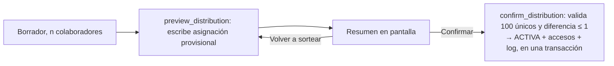
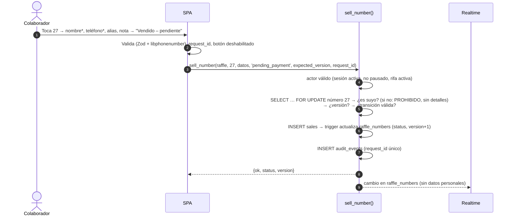
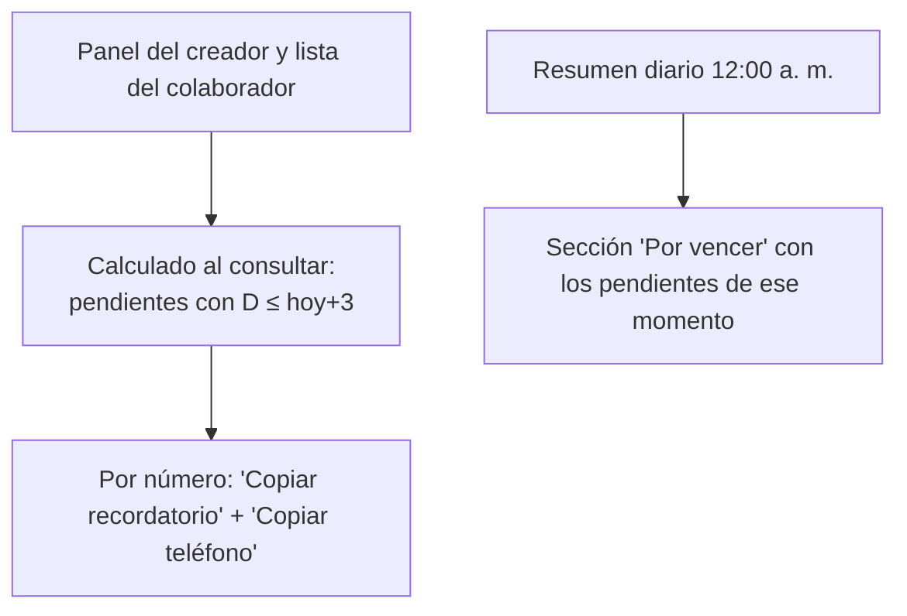
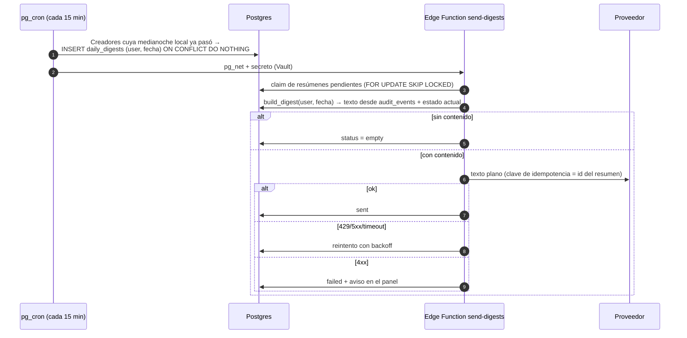
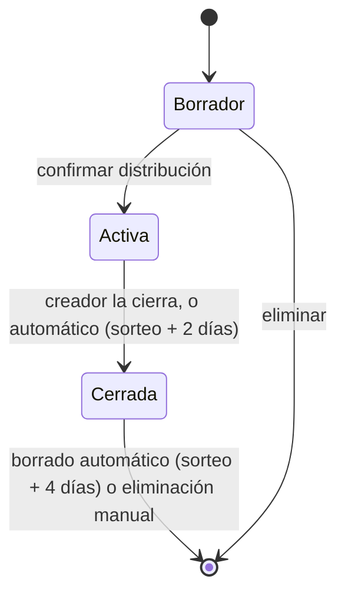
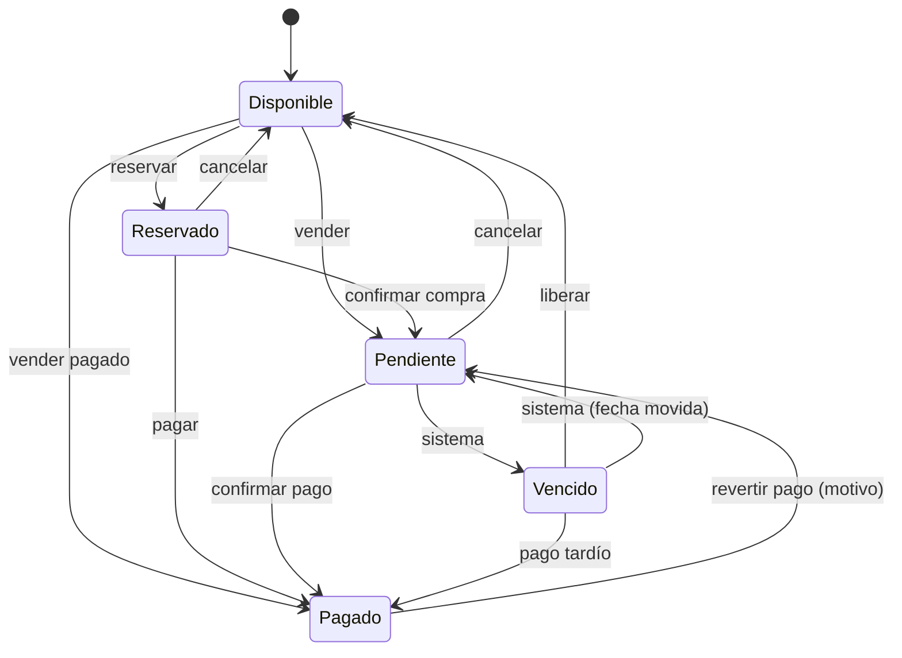
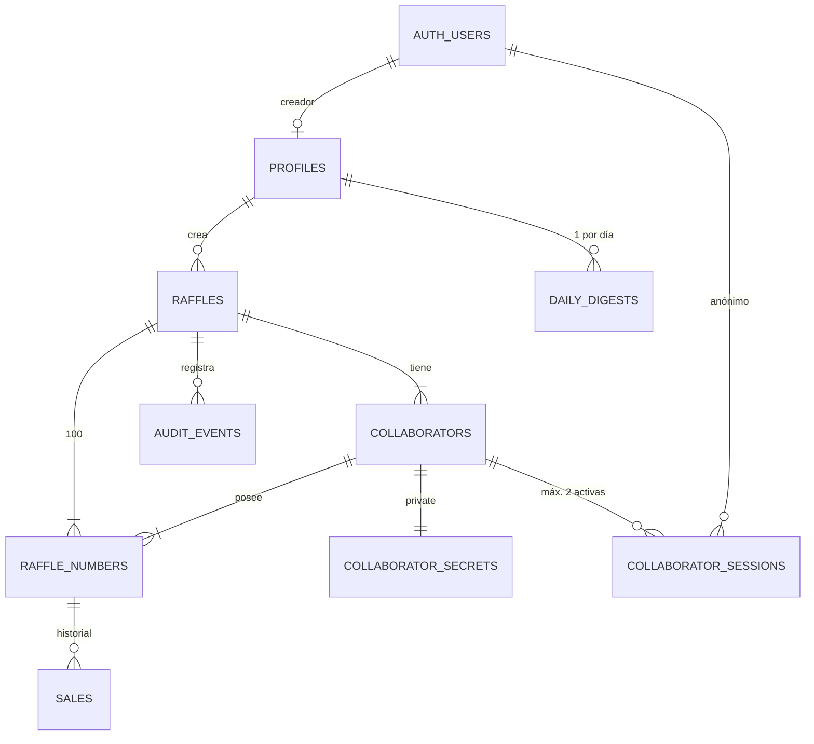
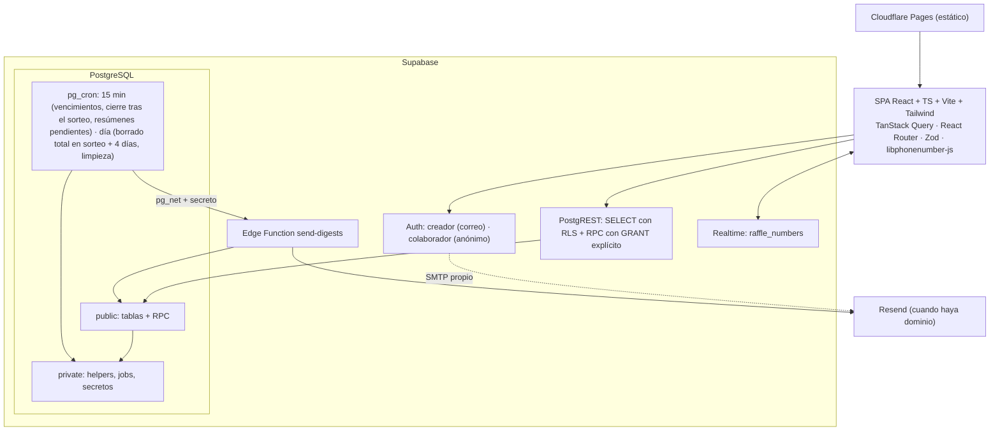
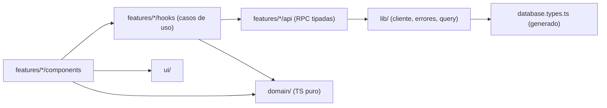

# Rifas4All — Documento de diseño técnico (v0.3)

> Estado: **aprobado e implementado** (2026-10-09). El código sigue este documento; las desviaciones se registran en los ADR de `docs/adr/`.
> Fecha: 2026-10-08. Sustituye a v0.1 (`docs/archivo/`). Motivos del cambio: `docs/rifas4all-revision-critica-v0.1.md` (los IDs H-xx remiten ahí).
> Convención: **[OBL]** obligatorio · **[REC]** recomendación · **[FUT]** futuro, fuera del MVP · **[SUP]** suposición revisable.

## Cambios de v0.3 (respuestas del 2026-10-08)

| Tema | Decisión |
|---|---|
| Recordatorio de pago | Solo texto para copiar, sin botón de WhatsApp |
| Enlace y PIN | Siempre visibles y copiables para el creador |
| **Correo** | **Un solo correo al día por creador, a las 12:00 a. m. de su zona horaria, con el resumen de los movimientos del día anterior** y las alertas de pagos. Sustituye a los correos por evento. **Esto cambia tu requisito original de "un correo por cada número vendido"**: la venta llega en el resumen de esa noche. |
| Consecuencias | Desaparecen la outbox por evento, el límite de 40 correos por rifa y la tabla `raffle_reminders`. El contenido se calcula a partir del log. Con ~100 correos/día del plan gratuito alcanza para ~100 creadores activos. |
| Ciclo de vida | La rifa se **cierra (solo lectura) a los 2 días del sorteo** y **se borra por completo a los 4 días**, liberando un cupo. Sin estado Archivada ni anonimización |
| Límite | **Máximo 5 rifas por cuenta**, en cualquier estado; para crear otra hay que eliminar una |

## Cambios de v0.2 respecto a v0.1

| Área | v0.1 | v0.2 |
|---|---|---|
| WhatsApp | `wa.me` y Web Share | **Solo "Copiar"**: la página genera el texto y la persona lo pega donde quiera (invitación y recordatorios) |
| Token y PIN | Hash; se muestran una sola vez | PIN generado siempre por el sistema; token y PIN en esquema privado; **el creador puede volver a copiar el mensaje cuando quiera** (H-12) |
| Recuperación | 3 acciones | 2: **Pausar/Reanudar** y **Nuevo acceso** (H-13) |
| Dispositivos | 5 | **2**, se revoca el menos usado (H-14) |
| Pagos | Solo el creador revierte | **Dueño o creador** revierten (motivo obligatorio); se elimina `pagado → disponible` (H-11) |
| Fecha límite | Por rifa + propia por venta | **Solo por rifa** |
| Recordatorios y vencimientos | 1 correo por venta | **1 correo de resumen por rifa** (H-19) |
| Estados de rifa | 5, con desarchivar | **Borrador, Activa, Cerrada** (en v0.3, sin Archivada) |
| Retención | 180 días | Borrado total en sorteo + 4 días (v0.3) |
| Esquemas | Todo en `public` | `public` + `private`; `EXECUTE` revocado por defecto (H-01) |
| Correos | HTML | **Texto plano** (H-04) |
| Tablas eliminadas | — | `idempotency_keys`, `notification_preferences`, `email_daily_usage`, `payment_reminders` por venta |
| Distribución aleatoria | Semilla reproducible | Barajado del servidor; se guarda el resultado |

---

## 1. Resumen ejecutivo

SPA mobile-first (React + TypeScript + Vite + Tailwind) sobre Supabase. La lógica crítica vive en PostgreSQL: los clientes **solo leen** (con RLS) y **solo escriben mediante funciones** que validan actor, estado y versión, y que registran el log en la misma transacción. Los colaboradores obtienen una identidad técnica con el inicio de sesión anónimo de Supabase, ligada a su acceso tras abrir su enlace (+PIN). El creador recibe un único resumen diario por correo a medianoche, calculado a partir del log por una Edge Function programada. Nada se integra con WhatsApp: la app genera textos para copiar. Coste: 0 USD hasta comprar el dominio.

## 2. Objetivo y público

Coordinar rifas caseras de 100 números con hasta 12 vendedores, sin hojas de cálculo y con trazabilidad. Público: familias, escuelas, comités, vecinos; uso desde el teléfono, poca experiencia técnica, conexión irregular. Mercado inicial Costa Rica (CRC, `America/Costa_Rica`), sin asumirlo en el modelo.

## 3. Alcance del MVP

1. Cuenta del creador: registro, confirmación de correo, inicio/cierre de sesión, recuperación de contraseña.
2. Rifas con ciclo de vida: Borrador → Activa → Cerrada (sorteo + 2 días) → borrado total (sorteo + 4 días).
3. 1–12 colaboradores (nombre; teléfono opcional; PIN opcional).
4. Distribución automática en orden o aleatoria, con vista previa y confirmación.
5. Acceso por enlace (+PIN); máximo 2 dispositivos; Pausar/Reanudar; Nuevo acceso; volver a copiar el mensaje.
6. Tablero 00–99 con filtros y panel inferior; estados accesibles.
7. Compradores y máquina de estados de ventas, incluida la reversión de pagos.
8. Vencimiento automático de pagos pendientes.
9. Tiempo real del tablero.
10. Resumen diario por correo al creador (texto plano, 12:00 a. m. de su zona horaria).
11. Recordatorio 3 días antes: sección en el resumen diario + alertas en la app + mensaje para copiar.
12. Log append-only.
13. Dashboard del creador y resumen del colaborador.
14. Cierre automático a los 2 días del sorteo; borrado total a los 4 días; máximo 5 rifas por cuenta; eliminar rifas.
15. Pruebas, CI, README y ADRs.

## 4. Excluido

Todo lo de tu §23, más lo que salió en las revisiones: integración con WhatsApp (incluidos `wa.me` y Web Share), desarchivar, rifa "Cancelada", fecha límite por venta, correos HTML, correos por evento, PWA, CAPTCHA (salvo que aparezca abuso).
**[FUT]**: rifas ≠ 100 números, registro del ganador, exportar CSV, PWA, correo inmediato opcional por venta, encadenamiento hash del log.

## 5. Actores e identidades

| Nivel | Qué es | Verificado |
|---|---|---|
| 1. Creador | Usuario de Supabase Auth **no anónimo**, correo confirmado | Sí |
| 2. Sesión del colaborador | Usuario **anónimo** de Supabase (un navegador) + fila activa en `collaborator_sessions` | Sí, técnicamente |
| 3. Nombre atribuido | `collaborators.display_name`, escrito por el creador | No: es una etiqueta |
| 4. Persona física | — | **Nunca** |

Actores: Creador (Administrador), Colaborador, Sistema (jobs), Visitante con enlace, Comprador (solo un dato; no usa la app).

**Regla de seguridad (H-02):** un usuario anónimo tiene el rol `authenticated`. Por eso **nunca** se concede algo "a cualquier autenticado": toda RPC de creador exige `is_anonymous = false`, y toda RPC de colaborador exige una sesión activa.

## 6. Matriz de permisos

✅ sí · 🔸 solo sus números/su lista · ❌ no. Todo se aplica en la base de datos.

| Acción | Creador | Colaborador | Sistema | Visitante |
|---|---|---|---|---|
| Ver rifa + nombre asignado al enlace | ✅ | ✅ | — | ✅ (solo eso) |
| Ver tablero (número, estado) | ✅ | ✅ | — | ❌ |
| Ver vendedor de cada número | ✅ | ✅ si `show_collaborator_names` | — | ❌ |
| Ver comprador, alias, teléfono, nota | ✅ | 🔸 | ✅ (correo) | ❌ |
| Reservar / vender | ✅ (rifa activa) | 🔸 (rifa activa) | ❌ | ❌ |
| Editar datos del comprador | ✅ | 🔸 | ❌ | ❌ |
| Marcar pagado | ✅ | 🔸 | ❌ | ❌ |
| **Revertir pago** (motivo obligatorio) | ✅ | 🔸 | ❌ | ❌ |
| Cancelar / liberar (no pagado) | ✅ | 🔸 | ❌ | ❌ |
| Marcar vencido / volver a pendiente por cambio de fecha | ❌ | ❌ | ✅ | ❌ |
| Configurar rifa, colaboradores, distribución | ✅ (según estado) | ❌ | ❌ | ❌ |
| Copiar mensaje de acceso, Pausar, Nuevo acceso | ✅ | ❌ | ❌ | ❌ |
| Ver log | ✅ todo | 🔸 eventos de su lista | — | ❌ |
| Modificar/borrar log | ❌ | ❌ | ❌ | ❌ |
| Cerrar rifa | ✅ (antes de tiempo) | ❌ | ✅ (sorteo + 2 días) | ❌ |
| Eliminar rifa (no activa) | ✅ | ❌ | ❌ | ❌ |
| Borrado total de la rifa | ✅ (eliminar) | ❌ | ✅ (sorteo + 4 días) | ❌ |
| Preferencias del resumen diario | ✅ | ❌ | — | ❌ |
| Estadísticas | ✅ completas | Progreso general (conteos) + las suyas | — | ❌ |

## 7. Casos de uso

CU-01 Cuenta del creador · CU-02 Crear rifa · CU-03 Gestionar colaboradores (borrador) · CU-04 Vista previa y confirmación de la distribución · CU-05 Copiar mensaje de acceso · CU-06 Activar acceso · CU-07 Ver y filtrar tablero · CU-08 Reservar/vender · CU-09 Editar comprador · CU-10 Confirmar pago · CU-11 Revertir pago · CU-12 Cancelar/liberar · CU-13 Vencimiento (sistema) · CU-14 Alertas de 3 días (calculadas) · CU-15 Copiar mensaje de recordatorio · CU-16 Resumen diario por correo (sistema) · CU-17 Pausar/Nuevo acceso · CU-18 Dashboard y log · CU-19 Cerrar/eliminar · CU-20 Cierre y borrado automáticos, limpieza (sistema).

## 8. Flujo general

```mermaid
flowchart LR
  A[Registro del creador] --> B[Rifa en BORRADOR]
  B --> C[1-12 colaboradores]
  C --> D[Vista previa de la distribución]
  D -->|Confirmar| E[ACTIVA + accesos]
  E --> F[Creador copia mensajes y los pega donde quiera]
  F --> G[Colaboradores activan]
  G --> H[Ventas, pagos, tiempo real, log, resumen diario]
  H -->|sorteo + 2 días| I[CERRADA: solo lectura]
  I -->|sorteo + 4 días| K[Rifa borrada por completo]
```



## 9. Flujo del creador

1. Registro → confirmación por correo → inicio de sesión.
2. Nueva rifa: nombre, fecha del sorteo, precio, moneda, fecha límite de pago, zona horaria; descripción opcional. Se guarda como borrador.
3. Colaboradores: filas con nombre*, teléfono y la casilla "Proteger con PIN".
4. Método → "Ver vista previa" → resumen por persona (cantidad y números).
5. "Confirmar y activar", con aviso: "Después no podrás cambiar los colaboradores ni el reparto".
6. Pantalla **Accesos**: por colaborador, el texto del mensaje en un cuadro seleccionable y los botones **Copiar mensaje**, **Copiar enlace** y **Copiar PIN**. Se puede volver a esta pantalla cuando se quiera.
7. Panel: tablero, alertas, actividad, accesos, configuración, log.

## 10. Flujo del colaborador

Abre el enlace → activación (§11) → "Mi lista" (resumen + tablero con filtro "Mis números") → toca un número propio → panel inferior con las acciones válidas. Las visitas siguientes entran directamente con la sesión del navegador; si la sesión se perdió, vuelve a abrir el mismo enlace.

## 11. Flujo de activación

URL: `https://<dominio>/i#<token>`. El fragmento (`#…`) no se envía al servidor ni a los registros del hosting, y la vista previa de enlaces de WhatsApp no lo ve. No cuesta nada y no estorba.

Mensaje que genera la app (plantilla fija en el MVP):

> Hola, Carlos. Has sido añadido como colaborador en la rifa Canasta Navideña.
> Enlace de acceso: https://…/i#…
> PIN: 4827
> Este acceso es personal. Las acciones realizadas aparecerán registradas a tu nombre.

Nota honesta: si el enlace y el PIN viajan en el mismo mensaje, el PIN no protege contra el reenvío de ese mensaje. Sí protege si el enlace termina en un grupo o en una captura de pantalla sin el PIN. Por eso la pantalla ofrece también "Copiar enlace" y "Copiar PIN" por separado.

```mermaid
sequenceDiagram
  autonumber
  actor V as Visitante
  participant UI as SPA (/i)
  participant DB as Postgres (RPC)
  participant Auth as Supabase Auth
  V->>UI: Abre /i#token
  UI->>UI: Lee el token, history.replaceState → "/i"
  alt hay sesión de creador en este navegador
    UI->>V: "Estás conectado como organizador. Abre el enlace en otro navegador o en incógnito."
  end
  UI->>DB: get_invitation_preview(token) [anon]
  DB-->>UI: {rifa, "Carlos", requiere_pin} | error genérico
  UI->>V: Aviso de responsabilidad + "Sí, soy Carlos" (+ PIN)
  V->>UI: Confirma
  UI->>Auth: signInAnonymously() (solo si el navegador no tiene sesión)
  UI->>DB: activate_access(token, pin, request_id)
  alt correcto
    DB->>DB: sesión nueva; si ya hay 2 → revoca la menos usada;<br/>si este navegador tenía otro colaborador de esta rifa → lo reemplaza;<br/>log
    DB-->>UI: {raffle_id}
    UI->>V: /r/:raffleId
  else PIN incorrecto
    DB->>DB: intentos++ ; al 5.º → bloqueo de 15 min ; log ; COMMIT (sin excepción)
    DB-->>UI: {PIN_INCORRECTO, restantes}
  else enlace no válido / pausado / rifa no activa
    DB-->>UI: {ENLACE_NO_VALIDO}
  end
```

Aviso obligatorio: *"Este acceso está asignado a Carlos. Todas las acciones realizadas con este acceso quedarán registradas a nombre de Carlos. No compartas el enlace ni el PIN."* + "¿No eres Carlos? Pide tu propio enlace al organizador."

## 12. Recuperación y restablecimiento

| Situación | Qué hace el creador | Efecto |
|---|---|---|
| Carlos perdió el mensaje | **Copiar mensaje** otra vez | Nada cambia |
| Nuevo teléfono / se borró el navegador | Nada: Carlos abre el mismo enlace (+PIN). Si ya tiene 2 dispositivos, se revoca el menos usado | Log: dispositivo nuevo |
| Olvidó el PIN | Copiar mensaje / Copiar PIN | Nada cambia |
| Sospecha de mal uso temporal | **Pausar** (luego Reanudar) | RLS deja de dar acceso de inmediato; enlace y sesiones se conservan |
| Teléfono perdido, enlace filtrado | **Nuevo acceso** | Nuevo token + nuevo PIN + todas las sesiones revocadas |

Ninguna acción toca números, ventas ni historial. Todas quedan en el log.

## 13. Distribución en orden

`base = floor(100/n)`, `resto = 100 mod n`. **Los primeros `resto` colaboradores por posición reciben `base + 1`.** Bloques contiguos desde 00.
Ejemplos: n=1 → 00–99 · n=3 → 00–33, 34–66, 67–99 · n=12 → cuatro de 9 y ocho de 8 (00–08, 09–17, 18–26, 27–35, 36–43, …, 92–99).

## 14. Distribución aleatoria

Mismos tamaños y misma regla de sobrantes (quién recibe uno más no depende del azar). El servidor baraja 00–99 (`ORDER BY gen_random_uuid()`) y reparte en orden de posición; cada lista se muestra ordenada.

**Semilla: no.** Reproducir un reparto solo tiene valor si un tercero va a verificarlo, y en una rifa casera nadie lo hará. Lo auditable es el **resultado**, que se guarda y se registra en el log inmutable al confirmar. En borrador se puede "volver a sortear"; cada vista previa queda en el log.



La generación la hace el servidor para que nadie pueda enviar un reparto inventado.

## 15. Venta o reserva



Reintento con el mismo `request_id` → choca con el índice único del log → la función responde "ya aplicado" con el estado actual. Versión distinta → `CONFLICTO`; la UI recarga el número y lo explica.

## 16. Confirmación y reversión de pago

- **Confirmar:** desde reservado, pendiente o vencido → pagado. Lo hace el dueño o el creador. Se guarda `paid_at` y `paid_late` (si fue después de la fecha límite). Confirmación: "¿Recibiste ₡2 000 de María por el 27?".
- **Revertir:** pagado → pendiente. Dueño o creador, **motivo obligatorio**; va al log y aparece destacado en el resumen diario. Si la fecha ya pasó, el job lo moverá a vencido en su siguiente ejecución.
- Para liberar un número pagado: revertir y luego cancelar (dos pasos explícitos y registrados).
- Todas estas acciones solo son posibles con la rifa **Activa** (hasta el final del día sorteo + 1). Con la rifa **Cerrada** no se puede modificar nada (§20).

## 17. Vencimiento

Fecha límite = **fecha civil** de la rifa en su zona horaria; vence al terminar ese día. Un job cada hora:
- `pendiente` con fecha pasada → `vencido` (actor: Sistema).
- Si el creador movió la fecha hacia adelante: `vencido` → `pendiente`.
- Los vencimientos aparecen en el resumen diario de esa noche.

`vencido` no libera el número. Es idempotente y toma bloqueos de fila (no choca con un pago que ocurra en ese mismo momento).

## 18. Recordatorio tres días antes

Ya no hay un job ni una tabla propios: el recordatorio es **una sección del resumen diario** y **una alerta calculada** en la app.

- **Correo:** el resumen que sale a las 12:00 a. m. del día D−3 incluye "Vencen en 3 días (D): 12 pagos pendientes" con número, comprador, teléfono, colaborador y monto. Los resúmenes de D−2, D−1 y D lo siguen mostrando como "Por vencer".
- **App:** el panel del creador y la lista del colaborador muestran la alerta mientras haya pendientes con D ≤ hoy + 3 (calculado al consultar).
- **Mensaje:** por cada número, "Copiar recordatorio" y "Copiar teléfono".



| Caso | Comportamiento |
|---|---|
| Ya pagado | No aparece: todo se calcula sobre los pendientes en ese momento |
| Cambia la fecha | El cálculo usa siempre la fecha vigente |
| Duplicados | Imposibles: hay un solo resumen por creador y día (§19) |
| Proceso caído | El resumen se reintenta (§30); las alertas de la app no dependen de él |
| Venta creada a 1 día del vencimiento | Aparece en la alerta de la app de inmediato y en el siguiente resumen |

Mensaje para copiar (plantilla editable por el creador; variables `{nombre}` (alias si existe), `{numero}`, `{rifa}`, `{fecha}`, `{monto}`):
*"Hola, {nombre}. Te recordamos que está pendiente el pago del número {numero} de la rifa {rifa}. La fecha límite es el {fecha}. Monto: {monto}. Muchas gracias."*

## 19. Correo: resumen diario

**Un correo por creador y día**, a las **12:00 a. m. de la zona horaria del creador**, con lo ocurrido el día anterior (00:00–23:59) en todas sus rifas activas o cerradas. Si no hubo movimientos ni alertas, no se envía nada.

Contenido (texto plano), por rifa:
1. Totales: vendidos, pagados, pendientes, vencidos, recaudado, pendiente de cobro.
2. Movimientos del día: reservas, ventas, pagos, **reversiones de pago** (destacadas, con motivo), cancelaciones y liberaciones; cada una con hora, número, colaborador, comprador, alias y teléfono (si `digest_include_phone`).
3. Vencieron hoy.
4. Por vencer (D ≤ hoy + 3), con "Vencen en 3 días" destacado el día D−3.
5. Accesos: activaciones, dispositivos nuevos y bloqueos de PIN.
6. Enlace al panel. Nunca enlaces de acceso, tokens ni PIN.

**El contenido se calcula a partir del log** en el momento de enviar, así que no hace falta guardar copias de los datos personales en una cola.



El proceso de vencimiento corre a las 00:00, así que el resumen ya incluye los pagos que vencieron al terminar el día.

## 20. Estados de la rifa

**Decisión final (2026-10-08):** tres estados y borrado total automático. Ejemplo con el sorteo el día 20 (D):

| Fechas (zona de la rifa) | Estado | Qué se puede hacer |
|---|---|---|
| Hasta el 21 a las 23:59 (D y D+1) | **Activa** | Todo: ventas, pagos, cambios. Sirve para consultar quién tiene el número ganador y registrar los últimos pagos |
| Desde el 22 a las 00:00 (D+2) | **Cerrada** | **Nada se puede modificar.** Creador y colaboradores solo pueden consultar |
| El 24 a las 00:00 (D+4) | — | **Se borra todo**: rifa, colaboradores, sesiones, números, ventas y log. Libera uno de los 5 cupos |



| Estado | Permitido | Bloqueado | Colaboradores |
|---|---|---|---|
| Borrador | Todo; vista previa; eliminar | Ventas | Sin accesos |
| Activa | Ventas y pagos; editar nombre, descripción, fechas (sorteo solo a fecha futura), plantilla, `show_collaborator_names`; renombrar colaborador; accesos; cerrar antes de tiempo | Altas/bajas de colaboradores, reparto, moneda; precio tras la primera venta; **eliminar** (primero hay que cerrarla) | Operativos |
| Cerrada | **Solo lectura**; eliminar | Toda modificación (ventas, pagos, accesos, configuración); jobs de vencimiento detenidos | Solo lectura |

Reglas:
- **Desaparece el estado Archivada** y la anonimización a los 15 días: con borrado total a los 4 días, ya no aportan nada.
- Todos los plazos se calculan desde la fecha del sorteo **vigente**. Si se aplaza, el creador cambia la fecha mientras la rifa esté Activa (solo a una fecha futura) y todos los plazos se mueven.
- Si el creador cierra antes de tiempo, la rifa queda en solo lectura, pero **el borrado sigue siendo en D+4** (no se adelanta). Para borrarla antes: "Eliminar".
- **Avisos** (en el panel y en el resumen diario): desde D: "La rifa se cerrará el 22 y se borrará por completo el 24". En D+2: "Rifa cerrada. Se borrará el 24 junto con todos sus datos". Si quedan pagos pendientes al cerrar, se resaltan con su monto ("Te quedan 3 pagos por ₡6 000 sin registrar; después del 24 no habrá registro").
- **Riesgo aceptado:** después de D+4 no queda ningún registro de la rifa ni de los pagos pendientes. La exportación (CSV) está fuera del MVP; el último resumen diario es la única copia que conserva el creador.
- Ejecución: el job de cada 15 minutos cierra las rifas cuya hora local pasó D+2 00:00, y el job diario borra las que pasaron D+4 00:00 (`DELETE` en cascada mediante una función de `private`). El borrado es idempotente y se prueba con pgTAP.
- Privacidad: el borrado total es la medida de retención. Los teléfonos de compradores viven como máximo hasta 4 días después del sorteo.

**Límite de cuenta: máximo 5 rifas por cuenta de correo, en cualquier estado** (incluye borradores y cerradas). Para crear una sexta hay que eliminar alguna o esperar a que se borre una cerrada.
- **Eliminar** una rifa la borra por completo: colaboradores, sesiones, números, ventas y log. Permitido en Borrador y Cerrada; una Activa hay que cerrarla primero. Confirmación reforzada: escribir el nombre de la rifa.
- El límite lo aplica la función `create_raffle` en la base de datos (contando con bloqueo de la fila del perfil, para que dos pestañas no creen la 6.ª a la vez), no solo la interfaz.
- Limitación conocida: una persona puede crear otra cuenta con otro correo. Es aceptable para el propósito del límite.

## 21. Estados de los números

El número tiene un estado **público**; la venta guarda los datos **privados** y puede estar `cancelled`. "Cancelado" es un estado de la venta, no del número.



| Transición | Quién | Requisitos |
|---|---|---|
| Disponible → R/P/Pagado | Dueño, creador; rifa **activa** | Nombre y teléfono; precio copiado de la rifa |
| Reservado → Pendiente/Pagado; Pendiente → Pagado; Vencido → Pagado | Dueño, creador | `paid_at`, `paid_late` automáticos |
| → Disponible (desde R, P, V) | Dueño, creador | `end_reason` (cancelado / liberado) |
| Pagado → Pendiente | Dueño, creador | Motivo (texto ≤ 140) |
| Pendiente ↔ Vencido | Solo Sistema | — |
| Editar comprador | Dueño, creador; venta no cancelada | Log con los **nombres** de los campos cambiados |

Al volver a Disponible, la venta queda `cancelled` (visible al creador y al dueño mientras exista la rifa) y una venta nueva crea otra fila. Garantías en la base de datos: índice único de venta activa por número; `CHECK` de coherencia; estado del número derivado de la venta por trigger; una sola función de transición; ninguna escritura directa desde el cliente.
Accesibilidad: cada estado con texto + icono, nunca solo color (Libre ○, Apartado ⏱, Por pagar ₡, Pagado ✓, Vencido ⚠).

## 22. Modelo conceptual



## 23. Tablas

Instantes en `timestamptz`; dinero en unidades menores (`bigint`) + ISO 4217.
Enums: `raffle_status` (draft, active, closed) · `distribution_method` (ordered, random) · `number_status` (available, reserved, pending_payment, paid, overdue) · `sale_status` (= number_status sin available + cancelled) · `actor_type` (creator, collaborator, system) · `digest_status` (pending, sending, sent, empty, failed).

**public.profiles** — `id` (→ auth.users), `display_name`, `time_zone text` (IANA; hora del resumen), `digest_enabled bool` default true, `digest_include_phone bool` default true, `created_at`.

**public.raffles** — `id`, `owner_id`, `name` (3–80), `description` (≤280), `status`, `number_count smallint CHECK (=100)`, `price_minor bigint >0`, `currency char(3)` (lista permitida), `draw_date date`, `payment_deadline date` (≤ draw_date), `time_zone text` (IANA), `distribution_method`, `distribution_confirmed_at`, `show_collaborator_names bool` default true, `reminder_template text` (≤500), `created_at`, `updated_at`, `activated_at`, `closed_at`. Los plazos de cierre y borrado se calculan desde `draw_date` + `time_zone` (no se guardan).

**public.collaborators** — `id`, `raffle_id`, `position smallint 1..12` (`UNIQUE(raffle_id, position)`), `display_name` (1–40), `phone_e164 null`, `pin_enabled bool`, `is_paused bool`, `first_activated_at`, `last_activity_at`, `created_at`.

**private.collaborator_secrets** (sin permisos para clientes) — `collaborator_id PK`, `token text UNIQUE` (32 bytes aleatorios en base64url), `pin char(4) null` (generado por el sistema), `pin_failed_attempts smallint`, `pin_locked_until`, `rotated_at`.

**public.collaborator_sessions** — `id`, `raffle_id`, `collaborator_id`, `auth_user_id`, `created_at`, `last_seen_at`, `revoked_at`, `revoked_reason`. Únicos parciales `WHERE revoked_at IS NULL`: `(raffle_id, auth_user_id)` (un colaborador por navegador y rifa). Máximo 2 activas por colaborador (lo hace cumplir la función de activación).

**public.raffle_numbers** (sin datos personales) — PK `(raffle_id, number)`, `number smallint 0..99`, `collaborator_id`, `status`, `current_sale_id null`, `version int`, `updated_at`. `CHECK ((status = 'available') = (current_sale_id IS NULL))`.

**public.sales** — `id`, `raffle_id`, `number`, `collaborator_id` (puesto por el servidor), `status`, `buyer_name`, `buyer_alias`, `buyer_phone_e164`, `note` (≤140), `price_minor`, `currency`, `reserved_at`, `committed_at`, `paid_at`, `paid_late bool`, `ended_at`, `end_reason`, `created_at`, `anonymized_at`. `CHECK`: `paid ⇒ paid_at`; `cancelled ⇒ ended_at`; nombre y teléfono no nulos salvo `anonymized_at`.

**public.audit_events** — `id bigint identity`, `raffle_id`, `occurred_at`, `actor_type`, `actor_user_id`, `actor_collaborator_id`, `actor_label` (instantánea), `collaborator_id` (lista afectada), `action`, `number`, `sale_id`, `from_status`, `to_status`, `details jsonb` (lista blanca por `action`), `result` (success, pin_failed), `request_id uuid null`.

**public.daily_digests** — PK `(user_id, digest_date)`, `status`, `attempts`, `next_attempt_at`, `locked_until`, `last_error` (saneado), `provider_message_id`, `created_at`, `sent_at`. No guarda el contenido del correo.

## 24. Restricciones e índices

- `UNIQUE (raffle_id, number) WHERE status <> 'cancelled'` en `sales` → **nunca dos ventas activas**.
- `UNIQUE (actor_user_id, request_id) WHERE request_id IS NOT NULL` en `audit_events` → idempotencia.
- PK `(user_id, digest_date)` en `daily_digests` → un resumen por creador y día.
- Validación del reparto al confirmar: 100 filas, 0–99, diferencia ≤ 1.
- Índices: `raffles(owner_id, status)`; `raffle_numbers(raffle_id, collaborator_id)`; `sales(raffle_id, collaborator_id, status)`; `sales(raffle_id) WHERE status='pending_payment'`; `collaborator_sessions(auth_user_id) WHERE revoked_at IS NULL` (lo usa RLS en cada consulta); `audit_events(raffle_id, id DESC)`; `audit_events(raffle_id, collaborator_id, id DESC)`; `audit_events(raffle_id, occurred_at)` (para el resumen); `daily_digests(status, next_attempt_at)`.
- Borrado en cascada solo a través de `private.delete_account` y `delete_raffle` (rechaza rifas activas).
- Máximo 5 filas en `raffles` por `owner_id`: lo comprueba `create_raffle` bloqueando antes la fila de `profiles` del creador.

## 25. Row Level Security y privilegios

1. Primera migración: `REVOKE EXECUTE ON ALL FUNCTIONS … FROM PUBLIC` + `ALTER DEFAULT PRIVILEGES` para que las funciones nuevas nazcan sin permisos; `GRANT` explícito por función (H-01). Desactivar `pg_graphql` (H-08).
2. Esquema `private` no expuesto: helpers (`require_creator`, `current_collaborator_id(raffle)`), jobs y secretos.
3. RLS en todas las tablas de `public`. Clientes con `SELECT` únicamente; **sin** `INSERT/UPDATE/DELETE`.
4. Las RPC de escritura son `SECURITY DEFINER` con `SET search_path = ''`, y comprueban actor → propiedad → estado → versión, en ese orden.

| Tabla | Creador (no anónimo) | Colaborador (sesión activa, no pausado, rifa activa o cerrada) |
|---|---|---|
| raffles, collaborators, collaborator_sessions | Sus rifas | ❌ directo → `get_collaborator_home()` devuelve solo rifa (nombre, fechas, precio, moneda, estado), su nombre y los nombres permitidos |
| raffle_numbers | Sus rifas | Toda la rifa |
| sales | Sus rifas | `collaborator_id = current_collaborator_id(raffle)` |
| audit_events | Sus rifas | Eventos de su lista |
| daily_digests | Los suyos (solo estado) | ❌ |
| private.* | ❌ | ❌ |

Rol `anon`: solo `get_invitation_preview(token)`.
Pruebas pgTAP obligatorias por perfil: creador dueño, otro creador, colaborador dueño, otro colaborador de la misma rifa, colaborador pausado, colaborador revocado, anónimo sin sesión, `anon`. Más: embedding de PostgREST, lista de funciones ejecutables, y ausencia de claves `buyer_*`/`note` en `audit_events.details`.

## 26. Sesiones de colaboradores

**Elegido: inicio de sesión anónimo de Supabase + `collaborator_sessions`.** Da un JWT real (refresco incluido), RLS y Realtime nativos, y revocación inmediata mediante la tabla. Alternativas descartadas: sesión propia por Edge Functions (perdería RLS como defensa) y JWT firmados a mano (gestión delicada de claves).

- El usuario anónimo se crea **solo después** de "Sí, soy Carlos" (las vistas previas y los bots no crean usuarios).
- Un navegador puede ser colaborador en varias rifas, pero solo de un colaborador por rifa.
- Máximo 2 sesiones activas por colaborador; la tercera revoca la de `last_seen_at` más antiguo (log + panel).
- `last_seen_at`/`last_activity_at` se actualizan como mucho cada 5 minutos.
- Con la rifa Cerrada las sesiones solo permiten leer; al borrarse la rifa desaparecen en cascada. Limpieza semanal de usuarios anónimos sin sesiones activas.
- Límite de tasa de inicios anónimos: revisar el valor en el panel de Supabase; CAPTCHA solo si aparece abuso.

## 27. Tokens y PIN

- **Token:** 32 bytes aleatorios (256 bits), base64url. No se puede enumerar. Se busca por igualdad indexada.
- **PIN:** 4 dígitos **generados siempre por el sistema** (se excluyen 0000, 1234, repetidos y secuencias). Nadie elige su PIN, así que no puede coincidir con el del banco.
- **Almacenamiento legible en `private` (ADR obligatorio).** Razón: el hash solo protege si alguien lee la base de datos, y en ese caso ya tiene todos los nombres y teléfonos y puede escribir. A cambio, guardarlo legible permite que el creador **vuelva a copiar el mensaje** sin expulsar a nadie. Riesgo residual aceptado y documentado.
- `get_access_message(collaborator_id)`: solo el dueño; devuelve el texto; registra `access.message_copied`.
- **Intentos:** 5 fallos → 15 min de bloqueo, contador a cero tras un acierto; sin bloqueo definitivo (H-06). El fallo se registra sin lanzar excepción.
- **Nunca** en: log, correos, analítica, errores, path o query de la app.

## 28. Concurrencia e idempotencia

1. **UI:** botón deshabilitado mientras se guarda (solo experiencia).
2. **Idempotencia:** `request_id` generado al abrir la confirmación y reutilizado en reintentos; índice único en el log.
3. **Integridad:** `SELECT … FOR UPDATE` + `expected_version` + índice único de venta activa.

| Escenario | Protección |
|---|---|
| Doble toque / red lenta / reintento | `request_id` |
| Dos pestañas, móvil + PC, creador + colaborador | Bloqueo de fila + versión → el segundo recibe `CONFLICTO` |
| Job de vencimiento a la vez que un pago | Bloqueo de fila; el job vuelve a comprobar el estado |
| UI desactualizada | Versión obsoleta → `CONFLICTO` + refetch |

Errores SQL tipados (`R4A_CONFLICT`, `R4A_FORBIDDEN`, `R4A_INVALID_TRANSITION`, `R4A_RAFFLE_STATE`, `R4A_ACCESS_PAUSED`, `R4A_VALIDATION`, `R4A_ALREADY_APPLIED`) → unión `AppError` en TS → mensajes en español en un solo módulo.

## 29. Tiempo real

- Postgres Changes **solo** sobre `raffle_numbers`, filtrado por `raffle_id`; RLS decide quién recibe cada cambio. `sales` no se publica.
- Realtime es una **señal**: al recibir un cambio se actualiza la caché y, si el número es propio, se vuelve a consultar la venta. Refetch completo al reconectar, al volver a la pestaña y al recuperar la red.
- Indicador "En vivo / Reconectando".
- Las filas de `raffle_numbers` nunca se borran (los DELETE no se filtran por RLS en Realtime).
- Colaborador pausado: su siguiente consulta devuelve `R4A_ACCESS_PAUSED` → "Tu acceso fue pausado por el organizador".

## 30. Correo y reintentos

**Sin dominio (estado actual, H-20):**
- Local: el capturador de correos de la CLI de Supabase.
- Producción: interruptor `EMAIL_ENABLED=false`. Los resúmenes se generan (estado visible en el panel) pero no se envían.
- **El registro público se abre solo después de comprar el dominio y configurar SMTP propio en Supabase Auth.** Sin eso, ningún creador desconocido recibiría la confirmación ni la recuperación de contraseña.

**Proveedor recomendado: Resend** (API simple; plan gratuito aproximado de ~3 000/mes y ~100/día; **verificar en su web en la Fase 6**). Alternativa: Brevo (~300/día). Cualquiera de los dos exige dominio verificado (SPF/DKIM/DMARC).

**Volumen:** 1 correo por creador y día. El tope del proveedor equivale a ~100 creadores con movimientos el mismo día. Un colaborador ya no puede agotar la cuota abusando de reservar y cancelar (H-03 queda resuelto por diseño), así que sobran los límites por rifa.

- **Hora:** medianoche de `profiles.time_zone`. El cron corre cada 15 minutos, así que el correo sale entre las 12:00 y las 12:15 a. m.
- **Rifas en zonas horarias distintas a la del creador:** el día del resumen es el del creador, y las fechas límite se muestran en la zona de cada rifa.
- **Reintentos:** backoff 5, 15, 60 min, 3 h; si a las 12:00 p. m. aún no salió → `failed` y aviso en el panel ("No pudimos enviarte el resumen de ayer"). El resumen siempre se puede ver también en la app (es una consulta al log).
- **Duplicados:** la clave `(user_id, digest_date)` impide generar dos; si el proceso muere a mitad del envío, la clave de idempotencia del proveedor es una defensa extra (confirmar su soporte).
- **Proceso caído varias horas:** al volver, genera los resúmenes de las fechas que falten (máximo 2 días hacia atrás).
- **Privacidad:** no se guarda el cuerpo del correo; `last_error` sin datos personales; saltos de línea eliminados del asunto.
- **[FUT]** Correo inmediato opcional por venta, si algún día se paga un plan de correo.

## 31. Log append-only

Lo escriben **las funciones de la base de datos, en la misma transacción que el cambio** (atómico, conoce la intención y el actor). No se escribe desde el frontend: allí se puede omitir, falsificar o perder.

- Sin permisos de escritura para los clientes; trigger contra `UPDATE`; `DELETE` solo mediante `private.delete_account` (H-21).
- `details` se construye con un helper de **lista blanca** por `action`; nunca datos del comprador, token, PIN ni cabeceras. La interfaz une el nombre del comprador por `sale_id` según RLS .
- Orden por `id`, no por hora.
- `result` solo registra lo que puede registrar de verdad: `success` y `pin_failed`. El estado del correo diario vive en `daily_digests`. Las acciones rechazadas no se registran (la excepción revierte la transacción), y así se documenta.
- Límite honesto: el dueño del proyecto Supabase puede desactivar el trigger; la garantía es "inmutable desde la aplicación".

Al **eliminar** una rifa su log se borra con ella (decisión del creador, con confirmación reforzada); "inmutable" significa que no se puede editar, no que sobreviva a la eliminación.

Acciones: `raffle.created/updated/activated/closed/auto_closed` (el borrado no se registra: el log se borra con la rifa) · `collaborator.created/renamed` · `distribution.previewed/confirmed` · `access.message_copied/activated/device_replaced/pin_failed/pin_locked/paused/resumed/regenerated` · `sale.reserved/sold/buyer_updated/payment_confirmed/payment_reverted/cancelled/released/overdue/reopened` · `settings.updated`.

Presentación: "Carlos registró la venta del número 27" · "Administrador (Juan) revirtió el pago del 12 · Motivo: error".

## 32. Arquitectura



Añadidos justificados: **Zod** (validación con tipos), **TanStack Query** (caché, refetch, reconexión), **React Router**, **libphonenumber-js** (E.164; la base de datos solo valida el formato), **Supabase CLI + Docker** (entorno local y migraciones; en Windows requiere WSL2), **pgTAP** (pruebas de RLS), **@axe-core/playwright** (accesibilidad), **Cloudflare Pages** (hosting gratuito; Vercel o Netlify sirven igual). Sin librería de fechas (Intl + SQL) ni de formularios por ahora.

Límites gratuitos de Supabase a vigilar (verificar): pausa tras ~7 días sin actividad, ~500 MB de base de datos, 2 proyectos, cuotas de Realtime y Edge Functions.

## 33. Dependencias del frontend



`domain/` no importa React ni Supabase. Las features se comunican solo a través de su `index.ts`. Sin repositorios ni inyección de dependencias: el cliente de Supabase ya es la frontera.

## 34. Estructura de carpetas

```
rifas4all/
├─ .github/workflows/ci.yml
├─ docs/  diseno-tecnico.md · revision-critica-v0.1.md · adr/ · archivo/
├─ supabase/
│  ├─ migrations/   (privilegios → esquema → RLS → funciones → cron)
│  ├─ seed.sql
│  ├─ tests/        pgTAP
│  └─ functions/send-digests/
├─ src/
│  ├─ app/          router, providers, error boundary
│  ├─ domain/       formato 00–99, tamaños de reparto, transiciones, dinero, teléfono, plantillas
│  ├─ features/     auth · raffles · collaborators · invitation · board · sales · dashboard · activity-log · settings
│  ├─ lib/          supabase.ts, errors.ts, query.ts, env.ts, clipboard.ts
│  └─ ui/           Button, BottomSheet, StatusBadge, NumberGrid, CopyBox
├─ tests/  integration/ · e2e/
├─ .env.example
└─ README.md
```

## 35. Testing

| Nivel | Herramienta | Alcance |
|---|---|---|
| Base de datos (**prioridad máxima**) | pgTAP | RLS por los 8 perfiles; privilegios de funciones; todas las transiciones válidas e inválidas; idempotencia; conflicto; reparto (n = 1..12); PIN y bloqueo; límite de 2 dispositivos; inmutabilidad del log y lista blanca de `details`; jobs (vencimiento, generación del resumen a medianoche local, un resumen por día, contenido de `build_digest` sin datos de otras cuentas, cierre en sorteo + 2 días, borrado total en sorteo + 4 días); límite de 5 rifas con dos creaciones simultáneas; eliminar rifa activa rechazado |
| Unitario | Vitest | `domain/` |
| Integración | Vitest + Supabase local | Solo lo que pgTAP no puede probar: dos conexiones simultáneas sobre el mismo número; contrato de transiciones TS ↔ SQL |
| Componentes | Testing Library | Cuadrícula accesible, panel inferior, CopyBox (incluido el caso sin portapapeles) |
| Edge Function | deno test | Clasificación de errores, backoff, resumen vacío no se envía, texto plano |
| E2E | Playwright (2 contextos) | 1) crear → activar → colaborador con PIN vende → el creador lo ve en vivo; 2) pausar con la app abierta; 3) conflicto entre dos pestañas |
| Accesibilidad | axe | Pantallas principales en viewport móvil |

CI en cada PR: lint, typecheck, unitarios, `supabase start` + `db reset` + pgTAP + integración, build. E2E en PR a `main`. Migraciones a producción **manuales**.

## 36. Casos límite

| Caso | Comportamiento | Protección |
|---|---|---|
| 1 colaborador | 00–99 | Función de reparto |
| 12 colaboradores | 4×9 + 8×8 | Función + pgTAP |
| División no exacta | Primeros `100 mod n` por posición, +1 | Documentado |
| Dos pestañas / doble toque / creador + colaborador | Un efecto; el otro, `CONFLICTO` o "ya aplicado" | Fila bloqueada + versión + `request_id` + índice único |
| Pausado con la app abierta | Siguiente acción → "acceso pausado" | RLS + helper |
| Enlace compartido | Actúa como Carlos (advertido); el creador ve el dispositivo nuevo | Log + límite de 2 |
| Tercer dispositivo | Revoca el menos usado | Función de activación |
| PIN incorrecto ×5 | Bloqueo de 15 min | Contador en BD, sin excepción |
| PIN olvidado / mensaje perdido | El creador vuelve a copiar | `get_access_message` |
| Teléfono perdido | Nuevo acceso | Revoca todo |
| Cambio de teléfono / sesión borrada | Reabre el enlace | Token reutilizable |
| Correo duplicado / cron ×2 | Imposible | PK `(user_id, digest_date)` |
| Proveedor caído o sin dominio | Reintentos; el resumen se ve en la app; la venta no se afecta | `daily_digests` |
| Abuso de reservar/cancelar | No genera correos extra (1 por día) | Diseño |
| Día sin movimientos | No se envía correo | `build_digest` |
| Fecha límite cambiada | Vencidos → pendientes si procede; las alertas usan la fecha nueva | Job + cálculo |
| Pago tardío | Vencido → Pagado, `paid_late` | Transiciones |
| Pago revertido por error | Pagado → Pendiente con motivo; correo al creador | Transiciones + log |
| Cancelado y revendido | Nueva fila de venta | Modelo |
| Cerrada con pagos pendientes | Avisos previos con el monto; quedan congelados y se borran en sorteo + 4 días | Estado + job + avisos |
| Intento de modificar una rifa cerrada | `R4A_RAFFLE_STATE`; la interfaz muestra todo en solo lectura | Funciones |
| Sorteo aplazado | El creador cambia la fecha antes de que pase; el plazo se mueve | Validación de fecha futura |
| Job de borrado ejecutado dos veces | La segunda no encuentra nada | `DELETE` idempotente |
| Intento de crear la 6.ª rifa | "Tienes 5 rifas. Elimina una para crear otra." | `create_raffle` |
| Dos pestañas creando la 5.ª y 6.ª a la vez | Solo una prospera | Bloqueo de la fila del perfil |
| Teléfono inválido | Error en el formulario; la BD rechaza lo que no sea E.164 | Cliente + CHECK |
| Portapapeles bloqueado | Texto seleccionable visible | CopyBox |
| Creador abre un enlace de colaborador | Aviso para usar otro navegador | Página de invitación |
| Conexión intermitente | Banner, acciones deshabilitadas, reintento idempotente, refetch | Cliente + BD |
| Servidor cambió, UI no | Respuesta de la RPC + Realtime + refetch al enfocar | Cliente |

## 37. Riesgos técnicos

| Riesgo | Mitigación |
|---|---|
| Fallo de RLS o de una función `SECURITY DEFINER` | Escritura solo por funciones, esquema `private`, privilegios explícitos, pgTAP por perfil, Security Advisor |
| Anónimo tratado como creador | `require_creator()` + tests |
| Cuota de correo | Resúmenes, límite por rifa, preferencias |
| Sin dominio | Interruptor de correo; registro público condicionado |
| Pausa del proyecto gratuito | Documentado |
| Almacenamiento borrado (Safari, navegador de WhatsApp) | Token reutilizable |
| Zonas horarias | Cálculo en SQL con IANA; tests en el cambio de día |
| Docker/WSL en Windows | Se valida en la Fase 1 |
| Divergencia TS ↔ SQL | Test de contrato |

## 38. Riesgos de privacidad

Nombres y teléfonos de terceros que no aceptaron términos; posible fuga entre colaboradores; datos personales en correos y en registros técnicos; enlaces en grupos; retención. Ley 8968 de Costa Rica: el creador es el responsable de los datos y la app el encargado (no es asesoría legal).

## 39. Mitigaciones

1. Minimización: nombre, teléfono, alias y nota breve (con aviso "no escribas datos sensibles").
2. `sales` aislada; `raffle_numbers` sin datos personales; secretos en `private`.
3. Retención: borrado total de la rifa 4 días después del sorteo, siempre; eliminar rifa manualmente; borrado total de la cuenta.
4. Correos en texto plano, teléfono opcional, sin credenciales; `payload` vaciado tras enviar.
5. Errores con códigos e ids, sin cuerpos; sin analítica de terceros en el MVP.
6. Cabeceras: CSP estricta, `Referrer-Policy: no-referrer`, `frame-ancestors 'none'`, `nosniff`, HSTS.
7. Claves: el frontend solo usa la URL y la clave **publicable**; la clave secreta y la API key del correo solo en secretos del servidor; escaneo de secretos de GitHub activado.
8. Límites: intentos de PIN, un correo diario por creador, máximo 5 rifas por cuenta, límites de Supabase Auth.
9. Privacidad y términos sencillos; casilla en el registro.

## 40. Plan por fases

| Fase | Entregable verificable |
|---|---|
| 1 | Repo, TS estricto, ESLint/Prettier, Vitest, Playwright, Supabase local, `.env.example`, CI básica, README, ADR-0001 |
| 2 | Migraciones (privilegios, esquemas, tablas, RLS, funciones, triggers), seed, pgTAP en verde |
| 3 | Auth del creador, CRUD de rifas en borrador |
| 4 | Colaboradores, reparto, pantalla de accesos (copiar), activación anónima + PIN, Pausar/Nuevo acceso |
| 5 | Tablero, panel inferior, transiciones, concurrencia, tiempo real |
| 6 | Vencimientos, alertas de 3 días, mensaje de recordatorio para copiar, resumen diario (vista en la app + Edge Function + cron; envío apagado hasta tener dominio) |
| 7 | Dashboard, log, cerrar/eliminar, cierre automático (sorteo + 2) y borrado total (sorteo + 4) |
| 8 | E2E, accesibilidad, rendimiento, seguridad, despliegue. **Hito aparte: dominio + SMTP → abrir el registro** |

En cada fase: objetivo, archivos, cambios pequeños, comandos exactos, pruebas, validación manual, y espero tu resultado.

## 41. Criterios de aceptación

1. Rifa creada y activada desde un teléfono en menos de 3 minutos.
2. Reparto correcto para n = 1..12 (100 números únicos, diferencia ≤ 1, regla de sobrantes).
3. Activación sin cuenta, con y sin PIN; el token no queda en la barra de direcciones.
4. Por API (no solo por UI), un colaborador no puede leer compradores ajenos, tocar números ajenos ni ver otras rifas; un anónimo no puede crear rifas.
5. Pausar / Nuevo acceso tienen efecto en la siguiente petición sin tocar ventas ni historial; nunca hay más de 2 dispositivos activos.
6. Ninguna combinación de concurrencia produce dos ventas activas para un número.
7. Los cambios llegan a otros dispositivos en ≤ 3 s en condiciones normales y se reconcilian al reconectar.
8. Como máximo un resumen por creador y día, enviado entre las 12:00 y las 12:15 a. m. de su zona horaria, con todos los movimientos del día anterior y los pagos por vencer; los fallos del proveedor no bloquean ventas y el resumen siempre puede consultarse en la app.
9. El log cubre todas las acciones de §31 y no contiene datos de compradores ni credenciales.
10. axe sin violaciones serias; uso con teclado y lector de pantalla; estados que no dependen del color.
11. CI en verde.

## 42. Checklist antes de publicar

- [ ] Ninguna función ejecutable por `anon`/`authenticated` sin `GRANT` intencional (test).
- [ ] RLS activo en todo `public`; Security Advisor sin alertas críticas; `pg_graphql` desactivado.
- [ ] Toda RPC de creador rechaza usuarios anónimos (test).
- [ ] Secretos solo en el servidor; historial de git limpio.
- [ ] Límite de tasa de inicios anónimos revisado.
- [ ] **Dominio + SPF/DKIM/DMARC + SMTP de Supabase Auth** antes de abrir el registro.
- [ ] Correos en texto plano revisados, sin credenciales.
- [ ] Jobs de cron activos y probados.
- [ ] Cabeceras de seguridad y reescritura de rutas de la SPA.
- [ ] Privacidad y términos publicados.
- [ ] Pruebas manuales: Android (Chrome y navegador interno de WhatsApp), iOS Safari, red lenta, sin red, portapapeles bloqueado.
- [ ] README con limitaciones conocidas (incluida "no se verifica a la persona física").

## 43. Preguntas pendientes

Todas resueltas el 2026-10-08: recordatorio solo para copiar; enlace y PIN siempre visibles para el creador; un resumen diario a medianoche; máximo 5 rifas por cuenta; **cierre en sorteo + 2 días (solo lectura) y borrado total en sorteo + 4 días** (§20).

No quedan preguntas abiertas.
